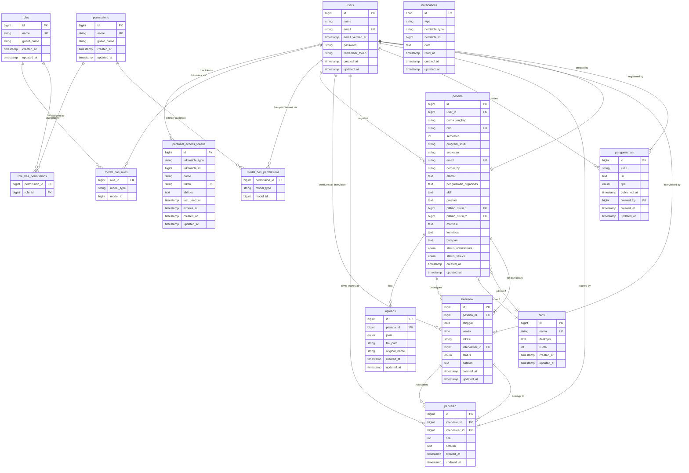

<!-- generated-by: gsd-doc-writer -->
# Dokumentasi Database — SIMAHATI OpRec

> **Proyek:** SIMAHATI OpRec — Sistem Open Recruitment Himpunan Mahasiswa Teknik Informatika
> **DBMS:** MySQL 8.0+
> **Backend:** Laravel 13 (Eloquent ORM)
> **Nama Database:** `simahati_oprec`

---

## Daftar Isi

- [Apa itu Database?](#apa-itu-database)
- [Daftar Tabel](#daftar-tabel)
- [1. Tabel users — Pengguna (PIC: Reyhan)](#1-tabel-users-pengguna-pic-reyhan)
- [2. Tabel personal_access_tokens — Token API (PIC: Reyhan)](#2-tabel-personal_access_tokens-token-api-pic-reyhan)
- [3. Tabel roles — Peran (PIC: Reyhan)](#3-tabel-roles-peran-pic-reyhan)
- [4. Tabel permissions — Izin (PIC: Reyhan)](#4-tabel-permissions-izin-pic-reyhan)
- [5. Tabel role_has_permissions — Penghubung Role dengan Izin (PIC: Reyhan)](#5-tabel-role_has_permissions-penghubung-role-dengan-izin-pic-reyhan)
- [6. Tabel model_has_roles — Penghubung User dengan Role (PIC: Reyhan)](#6-tabel-model_has_roles-penghubung-user-dengan-role-pic-reyhan)
- [7. Tabel model_has_permissions — Penghubung User Langsung dengan Izin (PIC: Reyhan)](#7-tabel-model_has_permissions-penghubung-user-langsung-dengan-izin-pic-reyhan)
- [8. Tabel peserta — Pendaftar (PIC: Nadil)](#8-tabel-peserta-pendaftar-pic-nadil)
- [9. Tabel uploads — Berkas Upload (PIC: Nadil)](#9-tabel-uploads-berkas-upload-pic-nadil)
- [10. Tabel divisi — Divisi Himpunan (PIC: Anton)](#10-tabel-divisi-divisi-himpunan-pic-anton)
- [11. Tabel interview — Wawancara (PIC: Anton)](#11-tabel-interview-wawancara-pic-anton)
- [12. Tabel penilaian — Nilai Wawancara (PIC: Anton)](#12-tabel-penilaian-nilai-wawancara-pic-anton)
- [13. Tabel pengumuman — Pengumuman (PIC: Rizky)](#13-tabel-pengumuman-pengumuman-pic-rizky)
- [14. Tabel notifications — Notifikasi (PIC: Rizky)](#14-tabel-notifications-notifikasi-pic-rizky)
- [Tabel Bawaan Laravel Lainnya](#tabel-bawaan-laravel-lainnya)
- [Ringkasan Migrasi](#ringkasan-migrasi)
- [Entity Relationship Diagram (ERD)](#entity-relationship-diagram-erd)
- [Tips dan Catatan Penting](#tips-dan-catatan-penting)

---

## Apa itu Database?

Kok ada file ini? Kenapa harus belajar database? Tenang, ini bakal seru kok. Bayangin kamu lagi mau nyatet data pendaftaran buat organisasi himpunan. Tiap orang daftar, kamu catat namanya, NIM-nya, nomor HP-nya, divisi yang dipilih, dan masih banyak lagi.

Nah, kalau cuma 5-10 orang, mungkin cukup pake kertas atau Excel. Tapi kalau pendaftarnya 200 orang? Ribet banget kalau harus nyari data satu-satu. Apalagi kalau datanya saling berhubungan — misal "siapa aja yang milih divisi Danus?" atau "siapa aja yang udah diinterview sama Kak Budi?"

**Database itu seperti lemari arsip raksasa yang super terorganisir.** Bedanya, database bisa diakses pake kode program (PHP, JavaScript, dll) dan bisa nyari data dalam hitungan detik.

### Analogi Lemari Arsip

Bayangin kamu punya lemari arsip gini:

| Di Dunia Nyata | Di Database |
|---|---|
| Lemari arsip | **Database** (kumpulan semua data) |
| Laci dalam lemari | **Tabel** (kumpulan data yang sejenis) |
| Kolom di map/formulir | **Kolom / Field** (jenis informasinya — "Nama", "NIM", dll) |
| Satu map lengkap | **Baris / Record** (data lengkap satu orang) |
| Nomor induk map | **Primary Key** (pengenal unik tiap baris) |

### Istilah Penting yang Wajib Kamu Paham

Sebelum lanjut, kita kenalan dulu sama istilah-istilah yang bakal sering dipake:

#### ✦ Database
**Database** (basis data) adalah kumpulan semua data yang disimpan secara terstruktur. Di proyek ini, nama databasenya adalah `simahati_oprec`. Semua data pendaftaran, user, nilai interview, semuanya ada di sini.

#### ✦ Tabel (Table)
**Tabel** adalah tempat nyimpen data yang sejenis. Bentuknya kayak spreadsheet Excel — ada baris (horizontal) dan kolom (vertikal).

Contoh: Tabel `users` nyimpen data semua pengguna. Tabel `peserta` nyimpen data semua pendaftar. Gak bakal ada data pendaftar nyempil di tabel `users` — karena udah dipisah rapi per tabel.

#### ✦ Kolom (Column / Field)
**Kolom** adalah jenis informasi tertentu yang disimpan. Misal tabel `peserta` punya kolom:
- `nama_lengkap` → isinya nama orang
- `nim` → isinya NIM
- `email` → isinya alamat email
- `nomor_hp` → isinya nomor handphone

Setiap kolom punya **tipe data** — misal `VARCHAR` buat teks pendek, `TEXT` buat teks panjang, `INT` buat angka, `DATE` buat tanggal, `ENUM` buat pilihan yang udah ditentukan.

#### ✦ Baris (Row / Record)
**Baris** adalah satu kesatuan data lengkap. Satu baris di tabel `peserta` berisi data lengkap satu orang pendaftar — mulai dari nama sampai motivasinya.

#### ✦ Primary Key (PK) — Kunci Utama

**Primary Key** kolom spesial yang jadi "KTP"-nya setiap baris. Setiap baris **WAJIB** punya nilai yang unik (gak boleh ada yang sama). Biasanya kita pake kolom `id` yang isinya angka: 1, 2, 3, ... dan **auto-increment** — artinya dia otomatis nambah sendiri, kita gak perlu ngisi manual.

Kenapa perlu PK? Biar kita bisa bedain data yang satu dengan yang lain. Misal ada 2 orang bernama "Budi Santoso" — PK-nya beda (id 1 dan id 2), jadi kita tau mereka orang yang berbeda.

#### ✦ Foreign Key (FK) — Kunci Tamu

**Foreign Key** adalah kolom yang nilainya nyambung ke Primary Key tabel lain. Ini yang bikin tabel-tabel bisa "ngobrol" satu sama lain.

**Analogi**: Bayangin KTP. Di KTP kamu ada kolom "Alamat" yang isinya nama kota. Nah, "nama kota" itu sebenernya nyambung ke data kota yang lebih lengkap — ada nama kota, kode pos, provinsi, dll. Di database, kolom yang nyimpen "nama kota" itu ibarat Foreign Key yang nyambung ke tabel kota.

Contoh nyata di proyek ini: Tabel `peserta` punya kolom `user_id` (FK). Kolom ini nyimpen angka id dari tabel `users`. Jadi kita tau "si pendaftar ini didaftarkan oleh user yang mana".

#### ✦ Relasi — Hubungan Antar Tabel

**Relasi** adalah cara tabel-tabel terhubung satu sama lain. Ada beberapa jenis:

**1. One-to-Many (Satu ke Banyak)**
Ini yang paling umum. Satu baris di tabel A bisa punya banyak baris di tabel B.

Contoh: Satu user (admin) bisa mendaftarkan **banyak** peserta. Jadi relasinya: **users one-to-many peserta**.

Cara bacanya: "Satu user punya banyak peserta. Satu peserta cuma punya satu user."

**2. Many-to-Many (Banyak ke Banyak)**
Satu baris di tabel A bisa punya banyak baris di tabel B, dan sebaliknya.

Contoh: Seorang user bisa punya banyak role (misal: dia admin sekaligus panitia). Sebuah role juga bisa dimiliki banyak user. Nah, untuk nyambungin many-to-mamy, kita butuh **tabel penghubung** (disebut juga tabel pivot).

Di proyek ini tabel penghubungnya:
- `role_has_permissions` — penghubung roles sama permissions
- `model_has_roles` — penghubung user sama roles
- `model_has_permissions` — penghubung user sama permissions

**3. Polymorphic (Bentuk Banyak)**
Ini versi lebih canggih dari many-to-many. Biasanya dipake pas satu tabel bisa nyambung ke beberapa tabel lain yang berbeda jenis.

Contoh: Tabel `notifications` bisa nyambung ke user, admin, atau model lainnya. Karena siapa aja bisa nerima notifikasi.

#### ✦ Constraint — Aturan

**Constraint** adalah aturan yang kita pasang di kolom. Misal:
- `NOT NULL` — kolom ini WAJIB diisi, gak boleh kosong
- `UNIQUE` — nilai di kolom ini harus unik, gak boleh ada duplikat
- `DEFAULT 'pending'` — kalau gak diisi, otomatis jadi 'pending'
- `CASCADE` — kalau data di tabel utama dihapus, data terkait ikut kehapus

#### ✦ Auto Increment

Fitur MySQL yang otomatis nambahin angka setiap kali data baru masuk. Jadi baris pertama `id`-nya 1, baris kedua `id`-nya 2, dan seterusnya. Kita gak perlu mikir ngisi `id` — database yang urus.

#### ✦ ENUM

Tipe data khusus yang cuma bisa diisi pilihan-pilihan tertentu. Misal kolom `status_administrasi` tipenya `ENUM('pending', 'verified', 'rejected')`. Artinya kolom ini cuma bisa diisi salah satu dari tiga pilihan itu. Gak bisa diisi "mungkin" atau "belum" — kalau gitu error.

#### ✦ Index

**Index** itu kayak daftar isi di buku. Kalau kamu mau nyari bab tertentu, kamu buka daftar isi, bukan baca buku dari halaman 1 sampe abis. Index di database kerjanya sama — bikin pencarian data jadi cepet banget.

Tapi index juga ada efek sampingnya: bikin proses nulis data (tambah/edit) sedikit lebih lambat karena databasenya harus ngupdate "daftar isi"-nya juga.

#### ✦ Migrasi (Migration)

**Migrasi** adalah file yang berisi "resep" cara bikin tabel. Di Laravel, migrasi ditulis dalam bentuk kode PHP. Kenapa pake migrasi? Biar semua anggota tim punya struktur database yang sama persis. Tinggal jalanin `php artisan migrate`, semua tabel kebikin otomatis — gak perlu manual ngetik SQL satu-satu.

### Cara Baca Notasi di Dokumen Ini

Sepanjang dokumen ini, kamu bakal nemuin notasi kayak gini:

```
users.id ──< peserta.user_id
```

Artinya: kolom `id` di tabel `users` (Primary Key) dihubungkan ke kolom `user_id` di tabel `peserta` (Foreign Key). Tanda `──<` bacanya "diacu oleh" atau "punya banyak".

Begitu juga notasi sebaliknya:

```
peserta.user_id ──> users.id
```

Artinya: kolom `user_id` di tabel `peserta` ngacu ke kolom `id` di tabel `users`.

---

## Daftar Tabel

Sebelum kita bahas satu-satu, ini dia daftar semua tabel yang ada di database `simahati_oprec`:

| No | Nama Tabel | Fungsi | Bawaan? |
|----|-----------|--------|---------|
| 1 | `users` | Data pengguna sistem (admin, panitia, interviewer) | Ya (Laravel) |
| 2 | `personal_access_tokens` | Token buat login API (biar aplikasi mobile sama web bisa saling kenal) | Ya (Sanctum) |
| 3 | `roles` | Daftar peran yang bisa dipunya user (super_admin, admin, panitia) | Ya (Spatie) |
| 4 | `permissions` | Daftar izin spesifik (misal: izin buat ngapus peserta) | Ya (Spatie) |
| 5 | `role_has_permissions` | Penghubung: role tertentu punya izin apa aja | Ya (Spatie) |
| 6 | `model_has_roles` | Penghubung: user tertentu punya role apa aja | Ya (Spatie) |
| 7 | `model_has_permissions` | Penghubung: user tertentu punya izin langsung apa aja | Ya (Spatie) |
| 8 | `peserta` | Data pendaftar OpRec — tabel paling penting | Kustom |
| 9 | `uploads` | File yang diupload peserta (foto, KTM, CV, sertifikat) | Kustom |
| 10 | `divisi` | Daftar divisi himpunan yang tersedia | Kustom |
| 11 | `interview` | Jadwal dan hasil wawancara peserta | Kustom |
| 12 | `penilaian` | Nilai dari hasil wawancara | Kustom |
| 13 | `pengumuman` | Pengumuman yang diterbitkan panitia | Kustom |
| 14 | `notifications` | Notifikasi yang dikirim ke user | Ya (Laravel) |
| — | `password_reset_tokens` | Token buat reset password | Ya (Laravel) |
| — | `sessions` | Data sesi login (siapa yang lagi login) | Ya (Laravel) |
| — | `cache` | Data cache biar aplikasi lebih cepat | Ya (Laravel) |
| — | `cache_locks` | Pengunci cache (biar gak tabrakan) | Ya (Laravel) |
| — | `jobs` | Antrean pekerjaan latar belakang | Ya (Laravel) |
| — | `job_batches` | Kumpulan antrean kerja (batch) | Ya (Laravel) |
| — | `failed_jobs` | Antrean kerja yang gagal | Ya (Laravel) |

Total ada **14 tabel utama** plus **7 tabel bawaan** = **21 tabel**.

> **Catatan**: Yang dimaksud "Bawaan" adalah tabel yang sudah disediakan oleh Laravel atau paket pihak ketiga (Sanctum, Spatie). Kita tinggal pakai, gak perlu bikin dari nol. Yang "Kustom" adalah tabel yang kita buat sendiri sesuai kebutuhan proyek.

Sekarang kita bahas SATU PER SATU. Siap? Gas!

---

## 1. Tabel `users` — Pengguna *(PIC: Reyhan)*

### 🔹 Fungsi

Bayangin kamu punya aplikasi yang cuma bisa diakses oleh orang-orang tertentu. Misalnya, aplikasi ini cuma boleh dipake oleh panitia Himatif, bukan oleh mahasiswa sembarangan. Nah, gimana caranya aplikasi tahu "oh, ini Budi, dia berhak login"? Jawabannya: tabel `users`.

Tabel `users` itu kayak **buku induk anggota** di sekretariat himpunan. Setiap orang yang resmi punya akses ke sistem — admin utama, panitia OpRec, interviewer — semuanya dicatat di sini. Namanya, emailnya, passwordnya (yang udah diacak), semuanya ada di tabel ini. Kalau kamu bayangin aplikasi ini kayak gedung kampus, tabel `users` itu daftar semua orang yang punya kartu akses gedung.

**Kapan tabel ini dipake?** Setiap kali ada yang login, daftar akun baru, atau lupa password. Siapa yang ngisi datanya? Biasanya admin utama yang bikin akun buat panitia dan interviewer. Tapi kadang ada juga fitur registrasi mandiri — misalnya interviewer daftar sendiri lewat form. Pokoknya, kalau ada orang baru yang perlu akses ke sistem, datanya masuk ke sini.

**Apa yang terjadi kalau tabel ini gak ada?** Gak ada yang bisa login. Aplikasi jadi gak berguna karena gak ada yang bisa ngakses dashboard. Semua fitur — ngelola peserta, ngisi nilai interview, bikin pengumuman — gak bisa diakses. Intinya, tabel `users` adalah **pintu gerbang** aplikasi. Tanpa pintu, gak ada yang bisa masuk.

**Skenario penggunaan**: Kak Budi (admin) mau nambah akun buat Kak Siti yang baru jadi panitia. Kak Budi buka halaman "Tambah User", isi nama "Siti Rahma", email "siti@himatif.com", dan password "rahasia123". Begitu disimpan, Laravel otomatis nge-hash passwordnya jadi kode acak kayak `$2y$12$...` dan nyimpen semuanya ke tabel `users`. Sekarang Kak Siti bisa login pake email dan password-nya. Kalau suatu saat Kak Siti lupa password, dia bisa minta reset — nanti Laravel bakal ngirim email berisi token, dan token itu dicocokin sama data di tabel `password_reset_tokens`.

### 🔹 Detail Kolom

| Kolom | Tipe Data | Penjelasan | Constraint |
|-------|-----------|------------|------------|
| `id` | BIGINT UNSIGNED | **Apa fungsinya?** Nomor induk setiap user. Angka unik yang membedakan Budi dengan Siti, meskipun mereka punya nama yang sama. **Kenapa BIGINT UNSIGNED?** BIGINT bisa nyimpen angka sampai 18.446.744.073.709.551.615 — gak bakal habis meskipun ada jutaan user. UNSIGNED artinya cuma angka positif (0, 1, 2, 3...), gak ada negatif. **Apa yang terjadi kalau salah?** Kalau kolom ini diisi manual dengan angka yang udah dipake, error "Duplicate entry". Tapi untungnya AUTO_INCREMENT ngurus ini otomatis. | **PK**, Auto Increment |
| `name` | VARCHAR(255) | **Apa fungsinya?** Nama lengkap user biar kita tahu siapa orangnya. **Kenapa VARCHAR(255) bukan TEXT?** VARCHAR(255) lebih efisien karena nama orang biasanya pendek (di bawah 255 karakter). TEXT dipake buat teks panjang kayak alamat atau deskripsi. Kalau pake TEXT buat nama, boros ruang penyimpanan. **Apa yang terjadi kalau diisi salah?** Misal diisi angka "12345" — secara teknis gak error, tapi secara logika gak masuk akal. Nama harusnya teks. **Kenapa NOT NULL?** Karena setiap user pasti punya nama. Gak masuk akal ada user tanpa nama. | NOT NULL |
| `email` | VARCHAR(255) | **Apa fungsinya?** Alamat email yang dipake buat login. Juga dipake buat ngirim notifikasi (misal: reset password). **Kenapa UNIQUE?** Karena email harus unik — gak boleh ada dua orang pake email yang sama. Bayangin kalau dua orang punya email "budi@mail.com" — pas login, sistem bingung mau masukin yang mana. **Kenapa VARCHAR(255)?** Email secara teknis bisa panjang (sampe 254 karakter), jadi 255 udah cukup. **Apa yang terjadi kalau duplikat?** Error "Duplicate entry 'budi@mail.com' for key 'users_email_unique'". | NOT NULL, **UNIQUE** |
| `email_verified_at` | TIMESTAMP | **Apa fungsinya?** Nyatet kapan email user udah diverifikasi. Biasanya pas daftar, sistem kirim email verifikasi. User klik link di email itu, baru kolom ini keisi. **Kenapa NULL?** Karena pas user baru daftar, dia BELUM verifikasi email. Kolom ini diisi nanti setelah user klik link verifikasi. **Apa yang terjadi kalau gak diverifikasi?** User tetep bisa login, tapi beberapa fitur mungkin dibatesin (misal: gak bisa daftarin peserta). | NULL (boleh kosong) |
| `password` | VARCHAR(255) | **Apa fungsinya?** Kata sandi yang dipake user buat login. Tapi yang disimpan BUKAN "rahasia123" — melainkan hasil hash-nya: `$2y$12$...` (kode acak sepanjang 60 karakter). **Kenapa di-hash?** Biar kalau database bocor, password asli gak ketahuan. Hash itu proses satu arah — dari hash gak bisa balik ke password asli. **Kenapa VARCHAR(255)?** Hasil hash Bcrypt (yang dipake Laravel) panjangnya 60 karakter, tapi VARCHAR(255) ngasih ruang lebih kalau di masa depan algoritma hash-nya diganti. **Apa yang terjadi kalau lupa di-hash?** Password disimpan dalam bentuk asli (plain text) — ini pelanggaran keamanan berat. Kalau database bocor, semua password user ketahuan. | NOT NULL |
| `remember_token` | VARCHAR(100) | **Apa fungsinya?** Token khusus buat fitur "Ingat Saya" (Remember Me). Pas user centang "Ingat Saya" pas login, Laravel bikin token random dan nyimpen di kolom ini. Token yang sama juga disimpan di cookie browser user. **Kenapa NULL?** Karena gak semua user pake fitur "Ingat Saya". Kalau user login biasa (gak centang), kolom ini tetap kosong. **Apa yang terjadi kalau diisi?** User gak perlu login ulang setiap kali buka aplikasi — cookie di browser otomatis ngenalin user. | NULL (boleh kosong) |
| `created_at` | TIMESTAMP | **Apa fungsinya?** Nyatet kapan user ini pertama kali dibuat/didaftarkan. Berguna buat laporan: "Bulan ini ada berapa user baru?" **Kenapa NULL?** Sebenarnya Laravel selalu ngisi ini otomatis, tapi secara teknis kolom ini boleh NULL. **Apa yang terjadi kalau gak keisi?** Gak tau kapan user itu daftar — susah bikin laporan. | NULL (boleh kosong) |
| `updated_at` | TIMESTAMP | **Apa fungsinya?** Nyatet kapan terakhir kali data user diubah. Misal user ganti nama atau email, kolom ini otomatis keupdate. **Kenapa NULL?** Sama kayak `created_at`, Laravel selalu ngisi ini otomatis. **Apa yang terjadi kalau gak keisi?** Gak tau kapan terakhir data diubah — susah tracking perubahan. | NULL (boleh kosong) |

### 🔹 SQL CREATE TABLE — Penjelasan Per Baris

```sql
CREATE TABLE users (
    id                BIGINT UNSIGNED  NOT NULL AUTO_INCREMENT PRIMARY KEY,
    name              VARCHAR(255)     NOT NULL,
    email             VARCHAR(255)     NOT NULL UNIQUE,
    email_verified_at TIMESTAMP        NULL,
    password          VARCHAR(255)     NOT NULL,
    remember_token    VARCHAR(100)     NULL,
    created_at        TIMESTAMP        NULL,
    updated_at        TIMESTAMP        NULL
);
```

Mari kita bedah setiap baris SQL di atas satu per satu:

**Baris 1: `CREATE TABLE users (`** — Ini perintah buat bikin tabel baru namanya `users`. Tanda kurung buka `(` artinya "kolom-kolomnya mulai dari sini ya".

**Baris 2: `id BIGINT UNSIGNED NOT NULL AUTO_INCREMENT PRIMARY KEY,`**
- `BIGINT` — Tipenya angka besar. Beda sama `INT` biasa yang cuma sampe 2 milyar. BIGINT bisa sampe 18,4 juta triliun. Kenapa gak pake INT aja? Karena best practice-nya Laravel pake BIGINT buat jaga-jaga kalau data membesar.
- `UNSIGNED` — Artinya cuma angka positif (0 ke atas). Gak ada user dengan id -5 kan? Makanya UNSIGNED.
- `NOT NULL` — Kolom ini WAJIB diisi. Gak boleh kosong. Tapi tenang, AUTO_INCREMENT ngisi otomatis.
- `AUTO_INCREMENT` — Setiap kali ada user baru, MySQL otomatis ngasih nomor id berikutnya. User pertama id=1, kedua id=2, dst. Kita gak perlu nyebutin id-nya pas insert data.
- `PRIMARY KEY` — Ini kolom yang jadi "KTP" setiap baris. Unik, gak boleh sama, dan dipake buat nyari data dengan cepat.

**Baris 3: `name VARCHAR(255) NOT NULL,`**
- `VARCHAR(255)` — Tipe teks dengan panjang maksimal 255 karakter. VARCHAR itu kependekan dari "Variable Character" — artinya panjangnya fleksibel. Kalau namanya cuma "Budi" (4 karakter), MySQL cuma nyimpen 4 karakter, bukan 255. Efisien!
- `NOT NULL` — Wajib diisi. Gak masuk akal ada user tanpa nama.

**Baris 4: `email VARCHAR(255) NOT NULL UNIQUE,`**
- `UNIQUE` — Constraint yang ngejamin gak ada dua baris dengan nilai email yang sama. Kalau ada yang daftar pake email "budi@mail.com" padahal udah dipake, MySQL bakal nolak dengan error "Duplicate entry".
- Kenapa UNIQUE penting? Karena email dipake buat login. Kalau ada duplikat, pas login sistem bingung — "user yang mana nih?"

**Baris 5: `email_verified_at TIMESTAMP NULL,`**
- `TIMESTAMP` — Tipe data buat nyimpen tanggal dan waktu. Formatnya `2026-07-16 14:30:00`.
- `NULL` — Boleh kosong. Karena pas user baru daftar, dia belum verifikasi email.

**Baris 6: `password VARCHAR(255) NOT NULL,`**
- `NOT NULL` — Password wajib diisi. Gak mungkin ada akun tanpa password.
- Tapi inget: yang disimpan di sini BUKAN password asli, melainkan hash-nya. Laravel otomatis nge-hash pas kita panggil `Hash::make($password)` atau pas pake `bcrypt()`.

**Baris 7: `remember_token VARCHAR(100) NULL,`**
- `VARCHAR(100)` — Tokennya panjangnya 100 karakter. Cukup buat string random yang aman.
- `NULL` — Boleh kosong karena gak semua user pake fitur "Ingat Saya".

**Baris 8-9: `created_at TIMESTAMP NULL,` dan `updated_at TIMESTAMP NULL,`**
- Dua kolom ini adalah standar Laravel. Waktu dibuat (`created_at`) dan waktu terakhir diubah (`updated_at`). Laravel otomatis ngisi dan ngupdate kolom ini — kita di kode gak perlu mikirin.

**Baris 10: `);`** — Tutup kurung plus titik koma, artinya "selesai bikin tabel".

### 🔹 Relasi

Tabel `users` adalah tabel paling sentral di database ini. Bayangin kayak pusat kota — banyak jalan yang nyambung ke sana. Berikut relasi-relasinya:

```
users.id ──< personal_access_tokens.tokenable_id
   Satu user bisa punya banyak token API (untuk login dari berbagai perangkat)
   Contoh: User id=1 (Budi) login dari laptop dan HP. Dua token berbeda dibuat, dua-duanya nyambung ke user id=1.

users.id ──< model_has_roles.model_id
   Satu user bisa punya banyak role (peran)
   Contoh: User id=1 (Budi) punya role "super_admin" dan "panitia" sekaligus. Dua baris di model_has_roles nyambung ke user id=1.

users.id ──< model_has_permissions.model_id
   Satu user bisa punya banyak izin langsung
   Contoh: User id=2 (Siti) dikasih izin langsung "delete-peserta" tanpa lewat role. Satu baris di model_has_permissions nyambung ke user id=2.

users.id ──< peserta.user_id
   Satu user bisa mendaftarkan banyak peserta
   Contoh: User id=3 (Kak Anton) daftarin 50 peserta OpRec. Semua 50 baris di tabel peserta punya user_id=3.

users.id ──< interview.interviewer_id
   Satu user bisa jadi pewawancara di banyak sesi interview
   Contoh: User id=4 (Kak Dewi) jadi interviewer buat 20 peserta. 20 baris di tabel interview punya interviewer_id=4.

users.id ──< penilaian.interviewer_id
   Satu user bisa ngasih nilai di banyak penilaian
   Contoh: User id=4 (Kak Dewi) ngasih nilai ke 20 peserta yang diinterview. 20 baris di tabel penilaian punya interviewer_id=4.

users.id ──< pengumuman.created_by
   Satu user bisa bikin banyak pengumuman
   Contoh: User id=1 (Budi) bikin 5 pengumuman selama OpRec. 5 baris di tabel pengumuman punya created_by=1.
```

**Apa efek kalau user dihapus?** Karena relasi-relasi di atas pake ON DELETE CASCADE (kecuali yang gak disebut), kalau user dihapus, data-data terkait ikut kehapus. Tapi hati-hati — tabel `peserta` biasanya pake ON DELETE CASCADE juga, jadi kalau user yang daftarin peserta dihapus, data peserta itu ikut hilang! Makanya, lebih aman pake "soft delete" atau ganti user_id-nya ke user lain sebelum dihapus.

### 🔹 Tips Penting

1. 🧠 **Password di-hash, bukan plain text.** Kalau kamu liat di database isinya `$2y$12$...` — itu hash Bcrypt, bukan password asli. Jangan panik. Laravel otomatis nge-hash pas pake `Hash::make()` atau pas login pake `Auth::attempt()`.

2. 🧠 **Kolom `email` UNIQUE** — Gak boleh ada dua user pake email yang sama. Kalau kamu coba insert email duplikat, MySQL bakal ngasih error: `Duplicate entry 'budi@mail.com' for key 'users_email_unique'`. Solusinya: pake email yang beda.

3. 🧠 **`created_at` dan `updated_at`** dikelola otomatis sama Laravel. Di kode tinggal panggil `$user->created_at` — Laravel otomatis ngubah formatnya jadi object Carbon yang gampang diolah (misal: `$user->created_at->diffForHumans()` jadi "3 days ago").

4. 🧠 **`id`-nya BIGINT UNSIGNED** — Angka maksimalnya 18.446.744.073.709.551.615. Bahkan kalau setiap orang di Indonesia (280 juta) punya 10 akun, masih sisa banyak. Gak bakal habis.

5. 🧠 **Tabel `users` gak punya kolom `role`** — Kenapa? Karena manajemen role dipisah ke tabel `roles`, `model_has_roles`, dll. Ini lebih fleksibel — satu user bisa punya banyak role, dan role bisa ditambah/diubah tanpa ngubah struktur tabel.

6. 🧠 **Debugging: "Login gagal, email gak ditemukan"** — Cek tabel `users`, apakah email yang diketik udah bener? Kadang user salah ketik email pas daftar. Cek juga apakah kolom `email` bener-bener ada isinya (gak NULL).

7. 🧠 **Debugging: "Password salah" padahal udah bener** — Mungkin user lupa password. Atau... mungkin passwordnya di-hash dua kali? Kadang programmer salah kode — password di-hash pas daftar, terus di-hash lagi pas login. Cek kode di controller.

8. 🧠 **Best practice: Jangan pernah hapus user** — Lebih baik nonaktifkan aja (tambah kolom `is_active` atau pake soft delete). Karena data user nyambung ke banyak tabel lain — peserta, interview, penilaian, pengumuman. Kalau user dihapus, data-data itu bisa ilang atau jadi yatim piatu (orphaned).

9. 🧠 **Best practice: Password minimal 8 karakter** — Laravel punya validasi bawaan. Tapi pastikan di form registrasi ada validasi `min:8`. Password yang pendek gampang ditebak.

10. 🧠 **Keamanan: Jangan pernah nampilin password di response API** — Waktu bikin API, jangan pernah ngirim kolom `password` atau `remember_token` ke frontend. Pake `$user->makeHidden(['password', 'remember_token'])` biar kolom-kolom itu gak ikut ke JSON.

### 🔹 Contoh Data

Berikut contoh bagaimana data di tabel `users` kelihatan:

| id | name | email | email_verified_at | password | remember_token | created_at | updated_at |
|----|------|-------|-------------------|----------|----------------|------------|------------|
| 1 | Budi Santoso | budi@himatif.com | 2026-07-16 08:00:00 | $2y$12$LJ3m...9XK | NULL | 2026-07-16 08:00:00 | 2026-07-16 08:00:00 |
| 2 | Siti Rahma | siti@himatif.com | 2026-07-16 09:30:00 | $2y$12$Kd8p...7Rm | 5a8f3c...b1e2 | 2026-07-16 09:30:00 | 2026-07-17 10:00:00 |
| 3 | Anton Wijaya | anton@himatif.com | NULL | $2y$12$M3n9...2Xk | NULL | 2026-07-17 14:00:00 | 2026-07-17 14:00:00 |

Perhatikan: Password di kolom `password` adalah hash (kode acak), bukan password asli. User id=3 (Anton) belum verifikasi email — kolom `email_verified_at`-nya NULL. User id=2 (Siti) punya `remember_token` — berarti dia pernah centang "Ingat Saya" pas login.

---

## 2. Tabel `personal_access_tokens` — Token API *(PIC: Reyhan)*

### 🔹 Fungsi

Coba bayangin: aplikasi ini punya dua bagian — backend (Laravel yang nyimpen data di database) dan frontend (React yang nampilin halaman). Mereka "ngobrol" lewat API. Setiap kali frontend minta data, backend perlu tahu "siapa yang minta? Apakah dia berhak?" Nah, buat ngejawab pertanyaan itu, dipakelah **token**.

**Analogi paling sederhana**: Bayangin kamu punya kartu akses gedung kampus. Setiap kali kamu masuk, kamu tap kartu itu di mesin pintu. Mesinnya ngecek "oh, ini kartunya Budi, id-nya 123, masih berlaku, silakan masuk". Token API kerjanya persis sama — aplikasi React "ngetap" token ini setiap kali minta data ke server Laravel. Server ngecek "oh, ini token punya Budi, masih berlaku, silakan ambil data".

**Kapan tabel ini dipake?** Setiap kali aplikasi frontend (React) atau mobile ngirim request ke API backend. Misalnya: pas user login lewat halaman web React, backend ngasih token. Token itu disimpan di localStorage browser. Setiap kali React minta data peserta, React ngirim token itu di header HTTP. Backend ngecek token di tabel `personal_access_tokens` — valid atau enggak. Kalau valid, data dikirim. Kalau gak valid, balasannya "401 Unauthorized".

**Apa yang terjadi kalau tabel ini gak ada?** Aplikasi frontend gak bisa login. Setiap kali minta data, selalu ditolak. API backend gak berguna karena gak ada yang bisa akses. Satu-satunya cara akses data cuma lewat web biasa (session-based), yang kurang cocok buat aplikasi React/modern.

**Skenario penggunaan**: Kak Budi login lewat aplikasi React. Dia masukin email "budi@himatif.com" dan password. Backend ngecek, cocok, lalu bikin token baru — misalnya namanya "auth-token" — dan nyimpen di tabel `personal_access_tokens`. Token yang udah di-hash dikirim balik ke React. React nyimpen token itu di localStorage. Setiap kali React minta data peserta, React ngirim token di header `Authorization: Bearer [token]`. Backend ngecek hash token di database, cocokin, kalau valid kirim data. Kalau token udah kadaluwarsa (lewat `expires_at`), backend balas "401 Unauthorized" dan React suruh user login ulang.

### 🔹 Detail Kolom

| Kolom | Tipe Data | Penjelasan | Constraint |
|-------|-----------|------------|------------|
| `id` | BIGINT UNSIGNED | **Apa fungsinya?** Nomor unik setiap token. Kayak nomor seri kartu akses. **Kenapa BIGINT UNSIGNED?** Sama kayak tabel users — jaga-jaga kalau ada jutaan token. **Apa yang terjadi kalau salah?** AUTO_INCREMENT ngurus otomatis, jadi aman. | **PK**, Auto Increment |
| `tokenable_type` | VARCHAR(255) | **Apa fungsinya?** Nama class model yang punya token ini. Biasanya `App\Models\User`. Ini bilang ke database: "token ini punya user ya, bukan punya model lain." **Kenapa perlu?** Karena relasinya polymorphic — artinya token ini gak cuma bisa dipunya User, tapi juga model lain (misal nanti ada model `Admin`). Kolom `tokenable_type` ini yang nentuin modelnya. **Apa yang terjadi kalau salah?** Misal diisi `App\Models\Admin` padahal model Admin gak ada — pas Laravel nyari relasi, error "Class not found". | NOT NULL |
| `tokenable_id` | BIGINT UNSIGNED | **Apa fungsinya?** ID dari model yang punya token. Misal: user id = 3. Jadi kombinasi `tokenable_type` = `App\Models\User` + `tokenable_id` = 3 artinya "token ini punya user dengan id 3". **Kenapa BIGINT UNSIGNED?** Sama kayak id di tabel users — biar cocok. **Apa yang terjadi kalau salah?** Misal diisi id=999 padahal user dengan id itu gak ada — token jadi gak berguna karena gak nyambung ke user mana pun. | NOT NULL |
| `name` | VARCHAR(255) | **Apa fungsinya?** Nama token biar kita tahu token ini buat apa. Misal "auth-token" buat login dari web, "mobile-app" buat login dari HP. **Kenapa perlu?** Biar user bisa bedain token-token yang dia punya. Di halaman profil, user bisa liat "Oh, saya punya 2 token: satu buat laptop, satu buat HP." **Apa yang terjadi kalau kosong?** Secara teknis error karena NOT NULL. Tapi secara logika, user bingung — token ini buat apa ya? | NOT NULL |
| `token` | VARCHAR(64) | **Apa fungsinya?** Ini adalah hash dari token asli. Pas user login, Laravel bikin token random (misal "abc123..."), lalu di-hash, dan hash-nya disimpan di sini. Token aslinya dikirim ke frontend. **Kenapa di-hash?** Biar kalau database bocor, token asli gak ketahuan. Sama kayak password — kita gak pernah nyimpen versi aslinya. **Kenapa UNIQUE?** Gak boleh ada dua token yang sama. Kalau ada duplikat, pas ngecek token, sistem bingung. **Kenapa VARCHAR(64)?** Hash token (SHA-256) panjangnya tepat 64 karakter. | NOT NULL, **UNIQUE** |
| `abilities` | TEXT | **Apa fungsinya?** Daftar kemampuan token ini — kira-kira token ini boleh ngapain aja. Formatnya JSON array, misal `["create", "read"]`. Kalau `NULL`, berarti token ini punya semua kemampuan (gak dibatesin). **Kenapa TEXT bukan VARCHAR?** Karena abilities bisa panjang — bisa berisi banyak izin. TEXT gak punya batasan panjang kayak VARCHAR. **Apa yang terjadi kalau diisi salah?** Misal diisi string biasa "create,read" bukan JSON array — pas Laravel parsing, error. | NULL |
| `last_used_at` | TIMESTAMP | **Apa fungsinya?** Nyatet kapan terakhir kali token ini dipake buat akses API. Berguna buat ngecek "token ini masih aktif dipake apa udah gak dipake?" **Kenapa NULL?** Pas token baru dibuat, belum pernah dipake. Jadi NULL. Nanti keisi otomatis pas pertama kali dipake. **Apa yang terjadi kalau gak keisi?** Gak tau token ini masih dipake apa udah gak dipake — susah nentuin token mana yang perlu dihapus (cleanup). | NULL |
| `expires_at` | TIMESTAMP | **Apa fungsinya?** Kapan token ini kadaluwarsa. Misal diisi `2026-07-20 23:59:59` — artinya token ini cuma berlaku sampe tanggal itu. Lewat dari itu, token gak bisa dipake. **Kenapa NULL?** Kalau NULL, artinya token gak punya masa berlaku — bisa dipake selamanya. Tapi ini gak disarankan buat keamanan. **Apa yang terjadi kalau token kadaluwarsa?** User dapet error 401 dan harus login lagi buat dapet token baru. | NULL |
| `created_at` | TIMESTAMP | Kapan token dibuat. Otomatis dari Laravel. | NULL |
| `updated_at` | TIMESTAMP | Kapan token diupdate. | NULL |

### 🔹 SQL CREATE TABLE — Penjelasan Per Baris

```sql
CREATE TABLE personal_access_tokens (
    id             BIGINT UNSIGNED  NOT NULL AUTO_INCREMENT PRIMARY KEY,
    tokenable_type VARCHAR(255)     NOT NULL,
    tokenable_id   BIGINT UNSIGNED  NOT NULL,
    name           VARCHAR(255)     NOT NULL,
    token          VARCHAR(64)      NOT NULL UNIQUE,
    abilities      TEXT             NULL,
    last_used_at   TIMESTAMP        NULL,
    expires_at     TIMESTAMP        NULL,
    created_at     TIMESTAMP        NULL,
    updated_at     TIMESTAMP        NULL
);
```

**Baris 1: `CREATE TABLE personal_access_tokens (`** — Bikin tabel baru namanya `personal_access_tokens`.

**Baris 2: `id BIGINT UNSIGNED NOT NULL AUTO_INCREMENT PRIMARY KEY,`** — Sama kayak tabel users. Nomor unik setiap token. AUTO_INCREMENT otomatis ngisi 1, 2, 3...

**Baris 3: `tokenable_type VARCHAR(255) NOT NULL,`** — Nama class model yang punya token. Isinya kayak `App\Models\User`. Ini penting buat relasi polymorphic — Laravel pake kolom ini buat nentuin "token ini nyambung ke tabel mana ya?"

**Baris 4: `tokenable_id BIGINT UNSIGNED NOT NULL,`** — ID dari model yang punya token. Misal user id = 3. Kombinasi `tokenable_type` + `tokenable_id` = alamat lengkap token ini.

**Baris 5: `name VARCHAR(255) NOT NULL,`** — Nama token. Biar user bisa bedain token buat laptop, buat HP, buat aplikasi mobile, dll.

**Baris 6: `token VARCHAR(64) NOT NULL UNIQUE,`** — Hash token sepanjang 64 karakter. UNIQUE biar gak ada duplikat. Yang disimpan di sini udah di-hash — aman.

**Baris 7: `abilities TEXT NULL,`** — Kemampuan token. TEXT karena bisa panjang. NULL berarti token bisa ngapa-ngapain.

**Baris 8: `last_used_at TIMESTAMP NULL,`** — Kapan terakhir dipake. NULL berarti belum pernah dipake.

**Baris 9: `expires_at TIMESTAMP NULL,`** — Kapan kadaluwarsa. NULL berarti gak kadaluwarsa.

**Baris 10-11: `created_at` dan `updated_at`** — Standar Laravel.

### 🔹 Relasi

```
personal_access_tokens.tokenable_id ──> users.id
   Token ini milik user tertentu. Tapi ini relasi POLYMORPHIC — artinya token gak cuma bisa dipunya User, tapi juga model lain.
   Contoh: User id=1 (Budi) login dari laptop → dapet token id=1. User id=1 (Budi) login dari HP → dapet token id=2.
   Dua token, dua baris, tapi dua-duanya nyambung ke user yang sama (id=1).
```

**Apa efek kalau user dihapus?** Karena ada `tokenable_type` + `tokenable_id`, dan Laravel Sanctum ngatur cascade-nya di kode, kalau user dihapus, semua token milik user itu ikut kehapus. Ini bagus — gak ada token "yatim piatu" yang nyambung ke user yang udah gak ada.

### 🔹 Tips Penting

1. 🧠 **Relasi Polymorphic**: Kolom `tokenable_type` + `tokenable_id` adalah pasangan yang bikin relasi ini "polymorphic". Artinya, token ini gak cuma bisa dipunya User, tapi juga model lain. Misal nanti ada model `Admin` — tinggal isi `tokenable_type` = `App\Models\Admin`. Fleksibel banget.

2. 🧠 **Token vs Session**: Token dipake buat API (aplikasi React/mobile). Session dipake buat akses web biasa (Laravel Blade). Bedanya: token dikirim manual di header HTTP, session dikelola otomatis sama browser pake cookie. Dua cara autentikasi yang beda, tapi tujuannya sama — ngenalin user.

3. 🧠 **Token punya masa berlaku (`expires_at`)**. Kalau kadaluwarsa, user harus login lagi buat dapet token baru. Best practice: set `expires_at` jangan terlalu lama (misal 7 hari atau 30 hari).

4. 🧠 **Debugging: "401 Unauthorized" terus** — Cek tabel `personal_access_tokens`. Apakah tokennya masih ada? Apakah `expires_at`-nya belum lewat? Apakah `token`-nya cocok? Kadang masalahnya cuma token udah kadaluwarsa.

5. 🧠 **Debugging: Token tiba-tiba gak valid** — Mungkin user-nya dihapus? Cek apakah `tokenable_id` di token masih nyambung ke user yang ada di tabel `users`. Kalau user dihapus, token jadi yatim piatu.

6. 🧠 **Best practice: Batasi umur token** — Jangan bikin token yang gak kadaluwarsa (NULL). Setel `expires_at` misal 7 hari atau 30 hari. Ini biar kalau token bocor, dampaknya terbatas.

7. 🧠 **Best practice: Hapus token lama** — Kalau user ganti password, sebaiknya hapus semua token lama user itu. Biar user harus login ulang di semua perangkat. Ini penting buat keamanan.

8. 🧠 **Debugging: "Token mismatch" atau "Token not found"** — Cek apakah token yang dikirim frontend sama dengan yang ada di database. Ingat: yang disimpan di database udah di-hash. Jadi pas ngecek, Laravel juga nge-hash token dari request, baru dibandingin.

9. 🧠 **Keamanan: Jangan pernah nampilin token asli di response** — Token asli cuma dikirim sekali pas login. Setelah itu, frontend harus nyimpen token dengan aman (localStorage dengan HTTPS, atau lebih baik pake httpOnly cookie).

10. 🧠 **Performa: Index di `token`** — Kolom `token` udah punya UNIQUE constraint, yang otomatis bikin index. Jadi pas ngecek token, pencariannya cepet banget — gak perlu scan semua baris.

### 🔹 Contoh Data

| id | tokenable_type | tokenable_id | name | token | abilities | last_used_at | expires_at | created_at | updated_at |
|----|---------------|--------------|------|-------|-----------|-------------|------------|------------|------------|
| 1 | App\Models\User | 1 | auth-token | $2y$12$e7a...9f2 | NULL | 2026-07-16 14:30:00 | 2026-08-16 00:00:00 | 2026-07-16 08:00:00 | 2026-07-16 14:30:00 |
| 2 | App\Models\User | 1 | mobile-app | $2y$12$k3b...1x8 | ["read"] | 2026-07-16 10:00:00 | 2026-08-16 00:00:00 | 2026-07-16 08:30:00 | 2026-07-16 10:00:00 |
| 3 | App\Models\User | 2 | auth-token | $2y$12$m9n...4p7 | NULL | NULL | 2026-07-20 00:00:00 | 2026-07-17 14:00:00 | 2026-07-17 14:00:00 |

Perhatikan: User id=1 (Budi) punya 2 token — satu buat laptop (auth-token), satu buat HP (mobile-app). Token id=3 punya Siti (user id=2) belum pernah dipake (`last_used_at` = NULL). Token id=2 cuma punya abilities `["read"]` — artinya cuma bisa baca data, gak bisa nulis.

---

## 3. Tabel `roles` — Peran *(PIC: Reyhan)*

### 🔹 Fungsi

Coba bayangin organisasi Himatif di kampus. Ada Ketua Himatif, ada Sekretaris, ada Bendahara, ada anggota biasa. Masing-masing punya wewenang yang beda. Ketua bisa ngambil keputusan besar. Sekretaris bisa bikin surat. Bendahara bisa ngelola uang. Nah, di aplikasi ini juga gitu — ada `super_admin` yang bisa ngapa-ngapain, ada `admin` yang bisa ngelola peserta, ada `panitia` yang cuma bisa ngisi data, dan ada `interviewer` yang cuma bisa ngasih nilai.

Tabel `roles` nyimpen daftar peran (role) tersebut. Isinya simpel: nama role-nya aja. Tapi kekuatan sebenernya ada di hubungannya sama tabel `permissions` — setiap role punya kumpulan izin tertentu. Ini yang nentuin "seorang super_admin boleh ngapain aja" vs "seorang panitia boleh ngapain aja".

**Analogi**: Di kampus, ada peran beda-beda: Mahasiswa biasa, Ketua Himatif, Sekretaris, Bendahara. Masing-masing punya wewenang yang beda. Nah, di aplikasi juga gitu. Role `super_admin` bisa ngapa-ngapain — bikin user, hapus peserta, apus interview, apa aja. Role `panitia` cuma bisa ngeliat data peserta dan ngisi nilai interview. Role `interviewer` cuma bisa ngisi nilai — gak bisa ngeliat data peserta lain.

**Kapan tabel ini dipake?** Pas admin bikin role baru (misal "ketua_pelaksana"), pas ngatur izin-izin yang dimiliki setiap role, dan pas ngecek "apakah user ini punya role X?" Biasanya tabel ini diisi sekali di awal proyek — bikin role `super_admin`, `admin`, `panitia`, `interviewer` — dan jarang diubah setelahnya.

**Apa yang terjadi kalau tabel ini gak ada?** Semua user punya akses yang sama — gak ada pembedaan wewenang. Admin dan panitia punya akses yang sama. Ini bahaya — panitia bisa hapus data, interviewer bisa ngubah pengumuman. Kacau balau.

**Skenario penggunaan**: Kak Budi (super_admin) mau ngasih akses ke Kak Siti yang baru jadi panitia. Kak Budi buka halaman "Kelola Role", centang role "panitia" buat Kak Siti. Di database, ini berarti nambah baris di tabel `model_has_roles` yang nyambungin user id=2 (Siti) ke role id=3 (panitia). Sekarang Kak Siti punya semua izin yang dimiliki role panitia — misal: lihat daftar peserta, input data peserta, tapi gak bisa hapus peserta.

### 🔹 Detail Kolom

| Kolom | Tipe Data | Penjelasan | Constraint |
|-------|-----------|------------|------------|
| `id` | BIGINT UNSIGNED | **Apa fungsinya?** Nomor unik setiap role. Role id=1 = super_admin, id=2 = admin, id=3 = panitia, dst. **Kenapa BIGINT UNSIGNED?** Standar Laravel. **Apa yang terjadi kalau salah?** AUTO_INCREMENT ngurus otomatis. | **PK**, Auto Increment |
| `name` | VARCHAR(255) | **Apa fungsinya?** Nama role. Misal: `super_admin`, `admin`, `panitia`, `interviewer`. Nama ini dipake di kode buat ngecek "apakah user ini punya role super_admin?" **Kenapa UNIQUE?** Gak boleh ada dua role dengan nama yang sama. Bayangin ada dua role namanya "admin" — bingung kan yang mana? **Kenapa VARCHAR(255)?** Nama role biasanya pendek (di bawah 50 karakter), tapi dikasih ruang 255 buat jaga-jaga. **Apa yang terjadi kalau duplikat?** Error "Duplicate entry 'admin' for key 'roles_name_unique'". | NOT NULL, **UNIQUE** |
| `guard_name` | VARCHAR(255) | **Apa fungsinya?** Nama guard yang dipake. Guard itu sistem autentikasi di Laravel — ada guard `web` (buat login lewat browser) dan guard `api` (buat login lewat API). Biasanya kita pake `web` aja. **Kenapa perlu?** Karena role bisa dibedain berdasarkan guard-nya. Misal, role `admin` di guard `web` beda sama role `admin` di guard `api`. Tapi di proyek ini, kita pake `web` buat semuanya. **Apa yang terjadi kalau salah?** Misal diisi "api" padahal guard yang dipake "web" — pas ngecek role, hasilnya gak ketemu. User yang tadinya punya role admin jadi gak terdeteksi sebagai admin. | NOT NULL |
| `created_at` | TIMESTAMP | Kapan role dibuat. | NULL |
| `updated_at` | TIMESTAMP | Kapan role diupdate. | NULL |

### 🔹 SQL CREATE TABLE — Penjelasan Per Baris

```sql
CREATE TABLE roles (
    id         BIGINT UNSIGNED  NOT NULL AUTO_INCREMENT PRIMARY KEY,
    name       VARCHAR(255)     NOT NULL UNIQUE,
    guard_name VARCHAR(255)     NOT NULL,
    created_at TIMESTAMP        NULL,
    updated_at TIMESTAMP        NULL
);
```

**Baris 1: `CREATE TABLE roles (`** — Bikin tabel `roles`.

**Baris 2: `id BIGINT UNSIGNED NOT NULL AUTO_INCREMENT PRIMARY KEY,`** — Nomor unik setiap role. AUTO_INCREMENT otomatis.

**Baris 3: `name VARCHAR(255) NOT NULL UNIQUE,`** — Nama role. UNIQUE — gak boleh ada dua role dengan nama yang sama. `super_admin` cuma boleh satu. `panitia` cuma boleh satu.

**Baris 4: `guard_name VARCHAR(255) NOT NULL,`** — Nama guard. Biasanya `web`. Ini penting buat Spatie — mereka pake guard buat nentuin "role ini dipake di konteks autentikasi yang mana."

**Baris 5-6: `created_at` dan `updated_at`** — Standar Laravel.

### 🔹 Relasi

```
roles.id ──< role_has_permissions.role_id
   Satu role punya banyak izin (lewat tabel penghubung)
   Contoh: Role "admin" (id=2) punya izin: create-peserta, edit-peserta, view-peserta, delete-peserta.
   Jadi di tabel role_has_permissions ada 4 baris dengan role_id=2.

roles.id ──< model_has_roles.role_id
   Satu role bisa dipunya banyak user (lewat tabel penghubung)
   Contoh: Role "panitia" (id=3) dipunya oleh 10 user. Jadi di tabel model_has_roles ada 10 baris dengan role_id=3.
```

**Apa efek kalau role dihapus?** Karena ada `ON DELETE CASCADE` di tabel `role_has_permissions` dan `model_has_roles`, kalau role dihapus, semua hubungan role-izin dan user-role ikut kehapus. Misal role "panitia" dihapus — semua user yang tadinya panitia kehilangan role-nya. Mereka masih bisa login, tapi gak punya akses apa-apa.

### 🔹 Tips Penting

1. 🧠 **Beda Role, Beda Akses**: `super_admin` bisa akses semuanya. `panitia` mungkin cuma bisa input data peserta dan lihat daftar. `interviewer` cuma bisa ngisi nilai. Ini diatur lewat permissions yang dikaitkan ke masing-masing role.

2. 🧠 **Kenapa `guard_name`?**: Laravel punya sistem guard — misal guard `web` buat akses browser, guard `api` buat akses API. Biasanya kita pake guard `web` aja. Tapi kalau suatu saat perlu dibedain, tinggal ganti guard_name-nya.

3. 🧠 **UNIQUE di `name`**: Gak boleh ada dua role dengan nama yang sama. Kalau kamu coba insert "admin" dua kali, MySQL error. Ini bagus — mencegah kebingungan.

4. 🧠 **Debugging: "User gak punya akses" padahal udah dikasih role** — Cek tabel `model_has_roles`. Apakah bener ada baris yang nyambungin user_id ke role_id? Cek juga `guard_name` di tabel `roles` — harusnya "web". Kalau guard_name-nya "api" padahal yang dipake guard "web", gak ketemu.

5. 🧠 **Debugging: Role gak muncul di daftar** — Cek tabel `roles`. Mungkin rolenya belum dibuat. Atau mungkin namanya typo — "panitia" vs "panitai". Bedain!

6. 🧠 **Best practice: Jangan hapus role yang lagi dipake** — Kalau role "panitia" dihapus, semua user yang tadinya panitia kehilangan akses. Lebih baik nonaktifkan aja atau ganti user-nya ke role lain dulu.

7. 🧠 **Best practice: Nama role pake snake_case** — `super_admin`, `admin`, `panitia`, `interviewer`. Konsisten biar gak bingung. Jangan campur "super_admin" sama "superadmin" — dianggap beda.

8. 🧠 **Best practice: Jangan bikin terlalu banyak role** — Idealnya 3-5 role aja. Terlalu banyak role bikin manajemen izin jadi rumit. Mulai dari role yang paling umum, tambahin kalau perlu.

9. 🧠 **Keamanan: Role `super_admin` harus dibatesin** — Cuma 1-2 orang yang boleh punya role ini. Karena super_admin bisa ngapa-ngapain, termasuk ngapus data penting. Jangan asal ngasih role super_admin.

10. 🧠 **Performa: Index di `name`** — UNIQUE constraint otomatis bikin index. Jadi pas nyari role berdasarkan nama, cepet banget.

### 🔹 Contoh Data

| id | name | guard_name | created_at | updated_at |
|----|------|------------|------------|------------|
| 1 | super_admin | web | 2026-07-01 00:00:00 | 2026-07-01 00:00:00 |
| 2 | admin | web | 2026-07-01 00:00:00 | 2026-07-01 00:00:00 |
| 3 | panitia | web | 2026-07-01 00:00:00 | 2026-07-01 00:00:00 |
| 4 | interviewer | web | 2026-07-01 00:00:00 | 2026-07-01 00:00:00 |

Keempat role ini biasanya dibuat sekali di awal proyek (via Seeder). Role `super_admin` (id=1) punya semua izin. Role `interviewer` (id=4) cuma punya izin terbatas — misal cuma `view-peserta` dan `create-penilaian`.

---

## 4. Tabel `permissions` — Izin *(PIC: Reyhan)*

### 🔹 Fungsi

Kalau tabel `roles` itu kayak "jabatan" (misal: Sekretaris), maka tabel `permissions` itu kayak "tugas spesifik" yang melekat di jabatan itu (misal: "boleh bikin surat", "boleh tanda tangan dokumen", "boleh akses lemari arsip"). Setiap role punya kumpulan permission tertentu. Tabel `permissions` nyimpen daftar semua izin yang mungkin ada di sistem.

**Apa bedanya role sama permission?** Role itu KELOMPOK izin. Permission itu IZIN TUNGGAL. Misal: role "admin" punya permission: `create-peserta`, `edit-peserta`, `view-peserta`, `delete-peserta`. Jadi kalau kita bilang "Budi adalah admin", artinya Budi punya keempat izin itu. Gampang kan?

**Analogi**: Di sekretariat Himatif, ada papan tugas yang nempel stiker "Sekretaris boleh: buat surat, tanda tangan dokumen, akses lemari arsip". Nah, "Sekretaris" itu role-nya. "Buat surat", "tanda tangan dokumen", "akses lemari arsip" itu permission-nya. Tabel `permissions` nyimpen daftar semua stiker tugas yang mungkin ada — `create-surat`, `sign-dokumen`, `access-arsip`, dll.

**Kapan tabel ini dipake?** Pas admin ngatur "role panitia boleh ngapain aja?" — admin milih permission-permission yang mau dikasih ke role panitia. Juga pas ngecek "apakah user ini punya izin buat hapus peserta?" — sistem ngecek lewat role user, atau langsung ke permission.

**Apa yang terjadi kalau tabel ini gak ada?** Gak ada cara buat nentuin "siapa boleh ngapain". Semua user punya akses yang sama. Atau sebaliknya — semua user gak punya akses apa-apa. Kacau.

**Skenario penggunaan**: Kak Budi (super_admin) mau ngatur izin role panitia. Dia buka halaman "Kelola Izin Role Panitia". Dia centang: `view-peserta`, `create-peserta`, `edit-peserta`. Tapi gak centang `delete-peserta`. Di database, ini berarti nambah 3 baris di tabel `role_has_permissions` yang nyambungin role_id=3 (panitia) ke permission_id=1 (view-peserta), permission_id=2 (create-peserta), permission_id=3 (edit-peserta). Sekarang semua panitia bisa lihat, tambah, dan edit peserta — tapi gak bisa hapus.

### 🔹 Detail Kolom

| Kolom | Tipe Data | Penjelasan | Constraint |
|-------|-----------|------------|------------|
| `id` | BIGINT UNSIGNED | **Apa fungsinya?** Nomor unik setiap permission. Misal: id=1 = `view-peserta`, id=2 = `create-peserta`, id=3 = `edit-peserta`, id=4 = `delete-peserta`. **Kenapa BIGINT UNSIGNED?** Standar Laravel. | **PK**, Auto Increment |
| `name` | VARCHAR(255) | **Apa fungsinya?** Nama permission. Biasanya format `kata-kerja-benda` pake strip. Contoh: `view-peserta`, `create-peserta`, `edit-peserta`, `delete-peserta`. Juga ada `view-divisi`, `create-divisi`, `view-pengumuman`, `create-pengumuman`, dll. **Kenapa formatnya gitu?** Biar konsisten dan gampang dibaca. `view-peserta` artinya "izin buat ngeliat data peserta". `create-peserta` artinya "izin buat nambah peserta". **Kenapa UNIQUE?** Gak boleh ada dua permission dengan nama yang sama. **Apa yang terjadi kalau duplikat?** Error MySQL. | NOT NULL, **UNIQUE** |
| `guard_name` | VARCHAR(255) | **Apa fungsinya?** Sama kayak di tabel roles — nentuin guard yang dipake. Biasanya `web`. **Kenapa perlu?** Biar permission ini cuma berlaku di guard tertentu. Tapi di proyek ini, kita pake `web` buat semuanya. | NOT NULL |
| `created_at` | TIMESTAMP | Kapan permission dibuat. | NULL |
| `updated_at` | TIMESTAMP | Kapan permission diupdate. | NULL |

### 🔹 SQL CREATE TABLE — Penjelasan Per Baris

```sql
CREATE TABLE permissions (
    id         BIGINT UNSIGNED  NOT NULL AUTO_INCREMENT PRIMARY KEY,
    name       VARCHAR(255)     NOT NULL UNIQUE,
    guard_name VARCHAR(255)     NOT NULL,
    created_at TIMESTAMP        NULL,
    updated_at TIMESTAMP        NULL
);
```

Strukturnya persis sama kayak tabel `roles`. Kenapa? Karena Spatie bikin tabel `roles` dan `permissions` dengan struktur yang identik — bedanya cuma di isi dan fungsinya. `roles` nyimpen nama jabatan, `permissions` nyimpen nama izin spesifik.

**Baris 3: `name VARCHAR(255) NOT NULL UNIQUE,`** — Nama permission. UNIQUE — gak boleh ada duplikat. Formatnya `kata-kerja-benda`. Contoh: `view-peserta`, `create-peserta`, `edit-peserta`, `delete-peserta`.

### 🔹 Relasi

```
permissions.id ──< role_has_permissions.permission_id
   Satu permission bisa dipunya banyak role
   Contoh: Permission "view-peserta" (id=1) dipunya oleh role super_admin, admin, panitia, interviewer — 4 baris di role_has_permissions.

permissions.id ──< model_has_permissions.permission_id
   Satu permission bisa langsung dikasih ke user (tanpa lewat role)
   Contoh: Permission "delete-peserta" (id=4) dikasih langsung ke user id=2 (Siti) — 1 baris di model_has_permissions.
```

**Apa efek kalau permission dihapus?** Semua role yang punya permission itu kehilangan izin tersebut. Misal permission "delete-peserta" dihapus — semua role (super_admin, admin) yang tadinya bisa hapus peserta, tiba-tiba gak bisa. Hati-hati!

### 🔹 Tips Penting

1. 🧠 **Role vs Permission**: Role itu KELOMPOK izin. Permission itu IZIN SPESIFIK. Biasanya kita kasih role ke user (misal "jadi panitia"), dan role itu otomatis punya kumpulan permission-nya. Tapi kalau perlu, kita juga bisa kasih permission langsung ke user tertentu tanpa lewat role.

2. 🧠 **Nama Permission**: Pakai format `kata-kerja-benda` (dengan strip). Contoh: `view-peserta`, `create-peserta`, `edit-peserta`, `delete-peserta`. Ini standard yang dipake banyak orang. Konsisten!

3. 🧠 **Jangan bikin permission yang terlalu umum** — Misal `manage-peserta` aja (gabungin view, create, edit, delete jadi satu). Ini kurang fleksibel. Lebih baik pisah-pisah biar bisa dikasih izin secara granular.

4. 🧠 **Debugging: "User gak bisa ngeliat peserta" padahal rolenya panitia** — Cek tabel `role_has_permissions`. Apakah role panitia punya permission `view-peserta`? Kalau gak ada, ya wajar gak bisa ngeliat.

5. 🧠 **Debugging: "Forbidden" atau "403" error** — Ini artinya user gak punya permission yang diperlukan. Cek: (1) Apakah user punya role yang bener? (2) Apakah role itu punya permission yang diperlukan? (3) Cek tabel `role_has_permissions`.

6. 🧠 **Best practice: Ikutin pola CRUD** — Buat setiap "entitas" (peserta, divisi, pengumuman, dll), bikin 4 permission: `view-{entitas}`, `create-{entitas}`, `edit-{entitas}`, `delete-{entitas}`. Ini pola CRUD (Create, Read, Update, Delete) yang standar.

7. 🧠 **Best practice: Jangan bikin permission yang gak dipake** — Setiap permission yang kamu bikin harus bener-bener dipake di kode. Permission yang nganggur cuma bikin bingung.

8. 🧠 **Keamanan: Permission `delete-*` harus dibatesin** — Izin hapus data (delete-peserta, delete-interview, dll) cuma boleh dikasih ke role tertentu (super_admin, admin). Jangan asal ngasih izin hapus ke panitia atau interviewer.

9. 🧠 **Performa: Index di `name`** — UNIQUE constraint otomatis bikin index. Cepet pas nyari permission berdasarkan nama.

10. 🧠 **Naming convention: pake strip (-) bukan underscore (_)** — `view-peserta` bukan `view_peserta`. Ini standar Spatie. Tapi kalau terlanjur pake underscore, gak masalah — yang penting konsisten.

### 🔹 Contoh Data

| id | name | guard_name | created_at | updated_at |
|----|------|------------|------------|------------|
| 1 | view-peserta | web | 2026-07-01 00:00:00 | 2026-07-01 00:00:00 |
| 2 | create-peserta | web | 2026-07-01 00:00:00 | 2026-07-01 00:00:00 |
| 3 | edit-peserta | web | 2026-07-01 00:00:00 | 2026-07-01 00:00:00 |
| 4 | delete-peserta | web | 2026-07-01 00:00:00 | 2026-07-01 00:00:00 |
| 5 | view-pengumuman | web | 2026-07-01 00:00:00 | 2026-07-01 00:00:00 |
| 6 | create-pengumuman | web | 2026-07-01 00:00:00 | 2026-07-01 00:00:00 |
| 7 | edit-pengumuman | web | 2026-07-01 00:00:00 | 2026-07-01 00:00:00 |
| 8 | delete-pengumuman | web | 2026-07-01 00:00:00 | 2026-07-01 00:00:00 |
| 9 | view-divisi | web | 2026-07-01 00:00:00 | 2026-07-01 00:00:00 |
| 10 | create-divisi | web | 2026-07-01 00:00:00 | 2026-07-01 00:00:00 |
| 11 | edit-divisi | web | 2026-07-01 00:00:00 | 2026-07-01 00:00:00 |
| 12 | delete-divisi | web | 2026-07-01 00:00:00 | 2026-07-01 00:00:00 |

Perhatikan pola CRUD: setiap entitas (peserta, divisi) punya 4 permission: view, create, edit, delete. Ini standar yang dipake di banyak aplikasi Laravel.

---

## 5. Tabel `role_has_permissions` — Penghubung Role dengan Izin *(PIC: Reyhan)*

### 🔹 Fungsi

Ini adalah **tabel penghubung** (pivot table). Fungsinya cuma satu: nyambungin tabel `roles` sama `permissions`. Dia jawab pertanyaan: "Role admin itu punya izin apa aja sih?" atau sebaliknya: "Permission `delete-peserta` itu dimiliki oleh role apa aja?"

**Kenapa perlu tabel penghubung?** Karena relasi antara role dan permission itu **many-to-many** — satu role punya banyak permission, dan satu permission bisa dimiliki banyak role. Di database, relasi many-to-many butuh tabel ketiga sebagai jembatan. Gak bisa langsung nyambungin roles.id ke permissions.id karena satu role butuh banyak permission, dan satu permission butuh banyak role.

**Analogi**: Bayangin di sekretariat Himatif ada papan besar. Di papan itu ada stiker-stiker. Setiap stiker nulis "Role X → Permission Y". Misal: "Super Admin → view-peserta", "Super Admin → create-peserta", "Admin → view-peserta", "Panitia → view-peserta". Nah, tabel `role_has_permissions` itu papan stiker-nya. Setiap stiker adalah satu baris di tabel ini.

**Kapan tabel ini dipake?** Setiap kali admin ngatur izin role — milih "role panitia boleh lihat peserta" — itu nambah baris di sini. Juga setiap kali sistem ngecek "apakah user ini punya izin X?" — sistem ngecek lewat role user, terus liat role_has_permissions.

**Apa yang terjadi kalau tabel ini gak ada?** Role dan permission gak nyambung. Role jadi gak berguna karena gak punya izin apa-apa. Permission juga gak berguna karena gak dikasih ke role mana pun.

### 🔹 Detail Kolom

| Kolom | Tipe Data | Penjelasan | Constraint |
|-------|-----------|------------|------------|
| `permission_id` | BIGINT UNSIGNED | **Apa fungsinya?** ID dari permission yang dikasih ke role. Misal: permission_id=1 artinya "view-peserta". **Kenapa BIGINT UNSIGNED?** Biar cocok sama tipe data id di tabel permissions. **Apa yang terjadi kalau diisi id yang gak ada?** Error foreign key constraint — MySQL nolak karena gak ada permission dengan id itu. | **PK** (bagian dari gabungan), FK ke `permissions.id` |
| `role_id` | BIGINT UNSIGNED | **Apa fungsinya?** ID dari role yang nerima permission. Misal: role_id=3 artinya role "panitia". **Apa yang terjadi kalau diisi id yang gak ada?** Error foreign key constraint. | **PK** (bagian dari gabungan), FK ke `roles.id` |

### 🔹 SQL CREATE TABLE — Penjelasan Per Baris

```sql
CREATE TABLE role_has_permissions (
    permission_id BIGINT UNSIGNED NOT NULL,
    role_id       BIGINT UNSIGNED NOT NULL,

    PRIMARY KEY (permission_id, role_id),
    FOREIGN KEY (permission_id) REFERENCES permissions(id) ON DELETE CASCADE,
    FOREIGN KEY (role_id) REFERENCES roles(id) ON DELETE CASCADE
);
```

**Baris 1: `CREATE TABLE role_has_permissions (`** — Bikin tabel penghubung.

**Baris 2-3: `permission_id BIGINT UNSIGNED NOT NULL,` dan `role_id BIGINT UNSIGNED NOT NULL,`** — Dua kolom, dua Foreign Key. Masing-masing NOT NULL karena hubungan ini wajib ada.

**Baris 5: `PRIMARY KEY (permission_id, role_id),`** — Ini **Composite Primary Key**. Artinya, primary key-nya bukan satu kolom, tapi gabungan dua kolom. Kombinasi `(permission_id, role_id)` harus unik. Gak boleh ada baris dengan permission_id=1 dan role_id=2 dua kali. Ini mencegah duplikasi data.

**Baris 6: `FOREIGN KEY (permission_id) REFERENCES permissions(id) ON DELETE CASCADE,`** — Kolom `permission_id` ngacu ke kolom `id` di tabel `permissions`. `ON DELETE CASCADE` artinya: kalau sebuah permission dihapus dari tabel `permissions`, semua baris di tabel ini yang nyambung ke permission itu ikut kehapus otomatis.

**Baris 7: `FOREIGN KEY (role_id) REFERENCES roles(id) ON DELETE CASCADE,`** — Sama, kolom `role_id` ngacu ke `roles.id`. Kalau role dihapus, baris-baris yang nyambung ke role itu ikut kehapus.

### 🔹 Relasi

```
role_has_permissions.permission_id ──> permissions.id
   Setiap baris di tabel ini nyambung ke satu permission.
   Contoh: permission_id=1 nyambung ke permission "view-peserta" di tabel permissions.

role_has_permissions.role_id ──> roles.id
   Setiap baris di tabel ini nyambung ke satu role.
   Contoh: role_id=3 nyambung ke role "panitia".
```

**Apa efek CASCADE?** Kalau permission "delete-peserta" (id=4) dihapus dari tabel `permissions`, semua baris di `role_has_permissions` yang punya `permission_id=4` ikut kehapus. Role-role yang tadinya punya izin hapus peserta, otomatis kehilangan izin itu. Gak perlu manual hapus satu-satu.

### 🔹 Tips Penting

1. 🧠 **Composite Primary Key**: Primary Key-nya bukan satu kolom, tapi gabungan `(permission_id, role_id)`. Ini biar gak ada data duplikat — gak boleh ada role yang dicatet dua kali punya permission yang sama. Kalau kamu coba insert `(permission_id=1, role_id=2)` dua kali, error.

2. 🧠 **CASCADE**: Kalau sebuah permission dihapus, otomatis semua baris di tabel ini yang nyambung ke permission itu juga ikut kehapus. Begitu juga kalau role dihapus. Ini biar datanya tetap konsisten — gak ada "hubungan" yang nyambung ke data yang udah gak ada.

3. 🧠 **Tabel ini cuma 2 kolom** — simpel kan? Itu karena tugasnya cuma nyambungin aja. Gak perlu kolom lain.

4. 🧠 **Debugging: "Role gak punya izin yang seharusnya"** — Cek tabel `role_has_permissions`. Apakah bener ada baris yang nyambungin role_id ke permission_id? Mungkin lupa nambahin pas setup awal.

5. 🧠 **Debugging: "Izin dobel" — error duplicate entry** — Ini sebenernya bagus! Artinya sistem mencegah duplikasi. Tapi kalau kamu butuh ngasih izin yang sama ke role yang sama, ya... gak perlu. Udah ada.

6. 🧠 **Best practice: Jangan edit langsung di database** — Tabel ini biasanya dikelola lewat kode Spatie: `$role->givePermissionTo('view-peserta')` atau `$role->syncPermissions([...])`. Jangan edit manual di phpMyAdmin kalau gak terpaksa.

7. 🧠 **Best practice: Pake `syncPermissions()`** — Kalau mau ngubah izin-izin suatu role, pake method `syncPermissions()` yang otomatis ngapus yang lama dan nambah yang baru. Lebih aman daripada hapus-tambah manual.

8. 🧠 **ON DELETE CASCADE itu pedang bermata dua** — Di satu sisi, ini jaga konsistensi data. Di sisi lain, kalau kamu salah hapus role, semua hubungan role-permission ilang. Untungnya, role jarang dihapus.

9. 🧠 **Performa: Index** — Composite Primary Key otomatis bikin index di `(permission_id, role_id)`. Tapi kalau sering nyari berdasarkan `role_id` aja (tanpa permission_id), performanya kurang optimal. Spatie udah ngurus ini.

10. 🧠 **Tabel ini gak punya kolom `id` sendiri** — Karena pake composite primary key, gak perlu kolom id tambahan. Ini lebih efisien.

### 🔹 Contoh Data

| permission_id | role_id |
|---------------|---------|
| 1 (view-peserta) | 1 (super_admin) |
| 2 (create-peserta) | 1 (super_admin) |
| 3 (edit-peserta) | 1 (super_admin) |
| 4 (delete-peserta) | 1 (super_admin) |
| 1 (view-peserta) | 2 (admin) |
| 2 (create-peserta) | 2 (admin) |
| 3 (edit-peserta) | 2 (admin) |
| 4 (delete-peserta) | 2 (admin) |
| 1 (view-peserta) | 3 (panitia) |
| 2 (create-peserta) | 3 (panitia) |
| 3 (edit-peserta) | 3 (panitia) |
| 1 (view-peserta) | 4 (interviewer) |

Dari data di atas, kita bisa liat:
- **Super Admin** (role_id=1) punya 4 permission: view, create, edit, delete peserta
- **Admin** (role_id=2) punya 4 permission: view, create, edit, delete peserta
- **Panitia** (role_id=3) punya 3 permission: view, create, edit (GAK punya delete)
- **Interviewer** (role_id=4) cuma punya 1 permission: view-peserta (cuma bisa liat)

Ini contoh nyata bagaimana role yang berbeda punya izin yang berbeda. Super Admin dan Admin punya akses penuh. Panitia gak bisa hapus. Interviewer cuma bisa liat.

---

## 6. Tabel `model_has_roles` — Penghubung User dengan Role *(PIC: Reyhan)*

### 🔹 Fungsi

Ini tabel penghubung yang nyambungin `users` sama `roles`. Dia jawab pertanyaan: "User si Budi itu role-nya apa aja?" atau sebaliknya: "Role admin itu dipunya oleh siapa aja?"

**Kenapa perlu tabel penghubung lagi?** Karena relasi antara user dan role juga **many-to-many**. Satu user bisa punya banyak role (misal Budi adalah super_admin sekaligus panitia). Satu role juga bisa dipunya banyak user (misal role panitia dipunya 10 orang). Lagi-lagi, butuh tabel ketiga sebagai jembatan.

**Analogi**: Bayangin buku catatan di sekretariat. Halaman pertama: "Budi → Super Admin, Panitia". Halaman kedua: "Siti → Admin". Halaman ketiga: "Andi → Panitia, Interviewer". Nah, tabel `model_has_roles` itu buku catatan-nya. Setiap baris nyatet "User X punya Role Y".

**Kapan tabel ini dipake?** Pas admin ngasih role ke user — misal "Budi jadi super_admin" — itu nambah baris di sini. Juga pas sistem ngecek "apakah user ini admin?" — sistem liat tabel ini.

**Apa yang terjadi kalau tabel ini gak ada?** User gak punya role. Semua user jadi "tak berperan" — gak punya akses apa-apa. Atau sebaliknya, semua user dianggap punya semua akses. Gak ada kontrol akses.

### 🔹 Detail Kolom

| Kolom | Tipe Data | Penjelasan | Constraint |
|-------|-----------|------------|------------|
| `role_id` | BIGINT UNSIGNED | **Apa fungsinya?** ID dari role yang dikasih ke user. Misal: role_id=1 artinya role "super_admin", role_id=3 artinya "panitia". **Kenapa BIGINT UNSIGNED?** Biar cocok sama tipe data id di tabel roles. **Apa yang terjadi kalau diisi id yang gak ada?** Error foreign key constraint — MySQL nolak karena gak ada role dengan id itu. **Kenapa NOT NULL?** Karena setiap baris di tabel ini WAJIB nyambung ke suatu role. | **PK** (bagian), FK ke `roles.id` |
| `model_type` | VARCHAR(255) | **Apa fungsinya?** Nama class model yang dikasih role. Biasanya `App\Models\User`. Kolom ini nentuin "data di baris ini nyambung ke tabel users ya." **Kenapa perlu?** Karena Spatie pake konsep polymorphic — bukan cuma User yang bisa punya role, tapi model lain juga. Makanya ditulis "model" bukan "user". **Apa yang terjadi kalau salah?** Misal diisi `App\Models\Peserta` — secara teknis bisa, tapi secara logika peserta gak perlu role. Atau diisi `App\Models\Admin` — kalau model Admin gak ada, pas Laravel nyari relasi, error. **Kenapa VARCHAR(255)?** Nama class model bisa panjang — `App\Models\User` aja 16 karakter. Dikasih 255 buat jaga-jaga. | **PK** (bagian) |
| `model_id` | BIGINT UNSIGNED | **Apa fungsinya?** ID dari user/model yang dikasih role. Misal: model_id=5 artinya user dengan id=5. Kombinasi `model_type` = `App\Models\User` + `model_id` = 5 artinya "user dengan id 5 punya role ini." **Apa yang terjadi kalau salah?** Misal diisi id=999 yang gak ada — data jadi yatim piatu. Pas Laravel nyari user dengan id 999, gak ketemu. Tapi secara database, gak error karena gak ada FOREIGN KEY constraint (karena polymorphic). | **PK** (bagian) |

### 🔹 SQL CREATE TABLE — Penjelasan Per Baris

```sql
CREATE TABLE model_has_roles (
    role_id    BIGINT UNSIGNED  NOT NULL,
    model_type VARCHAR(255)     NOT NULL,
    model_id   BIGINT UNSIGNED  NOT NULL,

    PRIMARY KEY (role_id, model_id, model_type),
    FOREIGN KEY (role_id) REFERENCES roles(id) ON DELETE CASCADE
);
-- model_type + model_id nyambung ke tabel users (atau model lain)
-- ini RELASI POLYMORPHIC — makanya gak pake FOREIGN KEY constraint formal
-- Laravel yang handle secara logika
```

**Baris 1: `CREATE TABLE model_has_roles (`** — Bikin tabel penghubung.

**Baris 2: `role_id BIGINT UNSIGNED NOT NULL,`** — ID role. NOT NULL karena setiap baris WAJIB nyambung ke suatu role.

**Baris 3: `model_type VARCHAR(255) NOT NULL,`** — Nama class model. Isinya `App\Models\User`. Ini yang bikin relasi ini polymorphic.

**Baris 4: `model_id BIGINT UNSIGNED NOT NULL,`** — ID user/model. Kombinasi `model_type` + `model_id` = alamat lengkap.

**Baris 6: `PRIMARY KEY (role_id, model_id, model_type),`** — Composite Primary Key dari 3 kolom. Kombinasi ketiganya harus unik. Gak boleh ada user yang dikasih role yang sama dua kali.

**Baris 7: `FOREIGN KEY (role_id) REFERENCES roles(id) ON DELETE CASCADE`** — Cuma role_id yang punya FOREIGN KEY formal. Kenapa `model_type` + `model_id` gak pake FK? Karena relasinya polymorphic — Laravel yang handle secara logika di kode, bukan di database.

### 🔹 Relasi

```
model_has_roles.role_id ──> roles.id
   Setiap baris nyambung ke satu role.
   Contoh: role_id=3 nyambung ke role "panitia" di tabel roles.

model_has_roles.model_id ──> users.id (polymorphic — lewat model_type)
   Setiap baris nyambung ke satu user (atau model lain).
   Contoh: model_type="App\Models\User", model_id=1 artinya user id=1 (Budi).
```

**Apa efek kalau role dihapus?** Karena ada `ON DELETE CASCADE`, kalau role "panitia" dihapus, semua baris di `model_has_roles` yang punya `role_id=3` ikut kehapus. Semua user yang tadinya panitia kehilangan role-nya.

**Apa efek kalau user dihapus?** Karena gak ada FOREIGN KEY constraint di `model_id` (karena polymorphic), data di `model_has_roles` TETAP ADA meskipun user dihapus. Ini bisa bikin data "yatim piatu" — baris yang nyambung ke user yang udah gak ada. Tapi tenang, Laravel biasanya ngurus ini di kode — pas hapus user, kita panggil `$user->delete()` yang otomatis ngapus juga relasi-relasinya.

### 🔹 Tips Penting

1. 🧠 **Polymorphic**: Kolom `model_type` isinya `App\Models\User` — ini bilang "data di baris ini nyambung ke tabel users ya". Kalau suatu saat ada model lain (misal `Admin`) yang mau dikasih role, tinggal ganti `model_type`-nya. Gak perlu bikin tabel baru.

2. 🧠 **Satu user bisa punya banyak role**: Misal user id=1 bisa punya role `super_admin` dan `panitia` sekaligus. Tinggal ada 2 baris di tabel ini — satu `(role_id=1, model_id=1)`, satu `(role_id=3, model_id=1)`.

3. 🧠 **Composite PK**: Uniknya pake kombinasi `(role_id, model_id, model_type)`. Jadi user yang sama gak bisa dikasih role yang sama dua kali. Kalau dicoba, error duplicate entry.

4. 🧠 **Debugging: "User gak punya akses admin" padahal udah dikasih role admin** — Cek tabel `model_has_roles`. Apakah ada baris dengan `role_id=2` (admin) dan `model_id` sesuai user? Mungkin lupa nyimpen.

5. 🧠 **Debugging: "User punya role dobel"** — Cek tabel `model_has_roles`. Mungkin ada 2 baris dengan role_id dan model_id yang sama? Seharusnya gak bisa karena composite PK. Tapi kalau ada, berarti ada yang salah.

6. 🧠 **Best practice: Pake `syncRoles()`** — Spatie punya method `$user->syncRoles([...])` yang otomatis ngatur tabel ini. Tinggal kasih array role, dia otomatis nambah yang kurang dan ngapus yang lebih.

7. 🧠 **Best practice: Jangan edit langsung di database** — Sama kayak `role_has_permissions`, tabel ini dikelola lewat kode: `$user->assignRole('admin')` atau `$user->syncRoles(['admin', 'panitia'])`.

8. 🧠 **Kenapa gak pake kolom `user_id` aja?** Kenapa repot-repot pake `model_type` + `model_id`? Karena Spatie dirancang buat fleksibel — bukan cuma User yang bisa punya role. Tapi di proyek ini, kita cuma pake User. Tetep aja, struktur polymorphic-nya dipake.

9. 🧠 **Debugging: "User kehilangan role setelah update"** — Mungkin ada kode yang panggil `$user->syncRoles()` tanpa nyertain role yang lama. `syncRoles()` itu ngeganti SEMUA role — jadi kalau lupa nyertain role lama, role itu ilang.

10. 🧠 **Performa: Index** — Composite PK di `(role_id, model_id, model_type)` udah cukup buat pencarian standar. Tapi kalau sering nyari "semua user yang punya role X", performanya kurang optimal karena `role_id` ada di posisi pertama composite index.

### 🔹 Contoh Data

| role_id | model_type | model_id |
|---------|------------|----------|
| 1 (super_admin) | App\Models\User | 1 (Budi) |
| 3 (panitia) | App\Models\User | 1 (Budi) |
| 2 (admin) | App\Models\User | 2 (Siti) |
| 3 (panitia) | App\Models\User | 3 (Anton) |
| 4 (interviewer) | App\Models\User | 3 (Anton) |
| 3 (panitia) | App\Models\User | 4 (Dewi) |

Dari data di atas:
- **Budi** (user id=1) punya 2 role: super_admin (role_id=1) dan panitia (role_id=3)
- **Siti** (user id=2) punya 1 role: admin (role_id=2)
- **Anton** (user id=3) punya 2 role: panitia (role_id=3) dan interviewer (role_id=4)
- **Dewi** (user id=4) punya 1 role: panitia (role_id=3)

---

## 7. Tabel `model_has_permissions` — Penghubung User Langsung dengan Izin *(PIC: Reyhan)*

### 🔹 Fungsi

Tabel ini mirip kayak `model_has_roles`, tapi bedanya: ini nyambungin user LANGSUNG ke permission — tanpa lewat role. Berguna kalau ada user tertentu yang perlu dapet izin tambahan di luar role-nya, atau sebaliknya — user tertentu perlu dibatesin izinnya.

**Analogi**: Bayangin di organisasi Himatif, ada aturan umum: "Panitia gak boleh hapus data." Tapi ternyata Budi (panitia) dipercaya punya izin hapus. Daripada ngubah aturan umum (ngubah role Panitia), lebih gampang kasih izin langsung ke Budi: "Budi, kamu khusus dikasih izin hapus data." Nah, tabel `model_has_permissions` ini yang nyatet "Budi → izin hapus data" secara langsung.

**Kapan tabel ini dipake?** Dalam kasus khusus — misal ada panitia yang dipercaya punya izin lebih dari panitia biasanya. Atau sebaliknya — ada admin yang perlu dibatesin izinnya. Tapi ini JARANG dipake. Biasanya, ngasih izin lewat role aja udah cukup.

**Apa yang terjadi kalau tabel ini gak ada?** Gak ada masalah besar. Karena sebagian besar izin dikasih lewat role. Tapi jadi gak ada cara buat ngasih izin khusus ke user tertentu tanpa ngubah role.

### 🔹 Detail Kolom

| Kolom | Tipe Data | Penjelasan | Constraint |
|-------|-----------|------------|------------|
| `permission_id` | BIGINT UNSIGNED | **Apa fungsinya?** ID dari permission yang dikasih langsung ke user. Misal: permission_id=4 artinya "delete-peserta". **Kenapa BIGINT UNSIGNED?** Biar cocok sama id di tabel permissions. **Apa yang terjadi kalau diisi id yang gak ada?** Error foreign key constraint. | **PK** (bagian), FK ke `permissions.id` |
| `model_type` | VARCHAR(255) | **Apa fungsinya?** Nama class model yang dikasih permission langsung. Biasanya `App\Models\User`. Sama kayak di `model_has_roles` — ini polymorphic. **Apa yang terjadi kalau salah?** Misal diisi `App\Models\Peserta` — secara teknis bisa, tapi secara logika gak masuk akal. | **PK** (bagian) |
| `model_id` | BIGINT UNSIGNED | **Apa fungsinya?** ID dari user/model yang dikasih permission langsung. Misal: model_id=2 artinya user id=2 (Siti). **Apa yang terjadi kalau salah?** Data jadi yatim piatu — nyambung ke user yang gak ada. | **PK** (bagian) |

### 🔹 SQL CREATE TABLE — Penjelasan Per Baris

```sql
CREATE TABLE model_has_permissions (
    permission_id BIGINT UNSIGNED  NOT NULL,
    model_type    VARCHAR(255)     NOT NULL,
    model_id      BIGINT UNSIGNED  NOT NULL,

    PRIMARY KEY (permission_id, model_id, model_type),
    FOREIGN KEY (permission_id) REFERENCES permissions(id) ON DELETE CASCADE
);
```

**Baris 1: `CREATE TABLE model_has_permissions (`** — Bikin tabel penghubung.

**Baris 2: `permission_id BIGINT UNSIGNED NOT NULL,`** — ID permission yang dikasih langsung. NOT NULL karena wajib.

**Baris 3: `model_type VARCHAR(255) NOT NULL,`** — Nama class model. Biasanya `App\Models\User`. Polymorphic.

**Baris 4: `model_id BIGINT UNSIGNED NOT NULL,`** — ID user/model.

**Baris 6: `PRIMARY KEY (permission_id, model_id, model_type),`** — Composite PK dari 3 kolom. Mencegah duplikasi.

**Baris 7: `FOREIGN KEY (permission_id) REFERENCES permissions(id) ON DELETE CASCADE`** — Cuma permission_id yang punya FK formal. Sama kayak `model_has_roles`, `model_type` + `model_id` gak pake FK karena polymorphic.

### 🔹 Relasi

```
model_has_permissions.permission_id ──> permissions.id
   Setiap baris nyambung ke satu permission.
   Contoh: permission_id=4 nyambung ke permission "delete-peserta".

model_has_permissions.model_id ──> users.id (polymorphic)
   Setiap baris nyambung ke satu user.
   Contoh: model_id=2 nyambung ke user id=2 (Siti).
```

**Apa efek kalau permission dihapus?** Karena ada `ON DELETE CASCADE`, kalau permission "delete-peserta" dihapus, semua baris di `model_has_permissions` yang punya `permission_id=4` ikut kehapus. User yang tadinya punya izin langsung "delete-peserta" otomatis kehilangan izin itu.

### 🔹 Tips Penting

1. 🧠 **Via Role vs Direct**: Kalau lewat role, permission didapet karena role-nya. Kalau direct, permission didapet langsung. Di aplikasi, pengecekan izin biasanya ngecek dua-duanya — "Apakah user ini punya permission X? Cek lewat rolenya, kalau gak ada cek yang direct."

2. 🧠 **Jarang dipake**: Biasanya, pemberian izin lewat role (`model_has_roles`) aja udah cukup. Yang pake direct (`model_has_permissions`) cuma untuk kasus khusus — misal ada panitia yang dipercaya punya izin lebih.

3. 🧠 **Debugging: "User punya izin yang seharusnya gak dimiliki"** — Cek tabel `model_has_permissions`. Mungkin ada baris yang ngasih permission langsung ke user itu. Cek juga `model_has_roles` + `role_has_permissions` — mungkin rolenya punya izin itu.

4. 🧠 **Debugging: "User gak punya izin padahal rolenya seharusnya punya"** — Cek `role_has_permissions` dulu. Apakah role-nya bener punya izin itu? Kalau iya, baru cek `model_has_permissions` — mungkin ada permission direct yang nge-override? (Sebenernya Spatie gak nge-override, tapi nambah.)

5. 🧠 **Best practice: Prioritaskan pemberian izin lewat role** — Jangan langsung ngasih permission ke user. Lebih susah diurus. Kasih lewat role aja — lebih rapi dan gampang diubah.

6. 🧠 **Kapan pake direct?** Kasus khusus aja. Misal: Ada panitia yang dipercaya punya izin hapus, tapi kita gak mau ngubah role panitia (karena panitia lain gak perlu izin itu). Atau ada admin yang perlu dibatesin — kita kasih permission langsung yang lebih terbatas.

7. 🧠 **Debugging: "User punya akses yang seharusnya gak dimiliki"** — Cek `model_has_permissions`. Mungkin ada permission direct yang dikasih ke user itu. Cek juga `model_has_roles` + `role_has_permissions` — mungkin rolenya punya izin itu.

8. 🧠 **Debugging: "User gak punya izin padahal rolenya seharusnya punya"** — Cek `role_has_permissions` dulu. Apakah role-nya bener punya izin itu? Kalau iya, baru cek hal lain — mungkin ada bug di kode pengecekan.

9. 🧠 **Best practice: Dokumentasiin kalo pake direct permission** — Karena direct permission jarang dipake, kasih komentar di kode atau dokumentasi kenapa user tertentu dikasih permission langsung. Biar programmer lain gak bingung.

10. 🧠 **Performa: Pengecekan izin** — Spatie ngecek izin lewat dua jalur (via role dan direct). Ini sedikit lebih lambat daripada cek satu jalur, tapi fleksibel. Untuk aplikasi skala kecil-menengah, gak masalah.

### 🔹 Contoh Data

| permission_id | model_type | model_id |
|---------------|------------|----------|
| 4 (delete-peserta) | App\Models\User | 2 (Siti) |
| 8 (delete-pengumuman) | App\Models\User | 2 (Siti) |

Dari data di atas, Siti (user id=2) dikasih 2 permission langsung: `delete-peserta` dan `delete-pengumuman`. Padahal role Siti mungkin cuma "admin" yang udah punya izin itu. Tapi kalau misalnya Siti role-nya "panitia" (yang gak punya izin hapus), dengan adanya 2 baris ini, Siti jadi punya izin hapus meskipun role-nya panitia. Ini contoh penggunaan direct permission — ngasih izin tambahan di luar role.

---

## 8. Tabel `peserta` — Pendaftar *(PIC: Nadil)*

### Penjelasan

Tabel `peserta` adalah tabel PALING PENTING di aplikasi. Semua data pendaftar OpRec disimpan di sini — data diri, pilihan divisi, status administrasi, dan status seleksi. Setiap peserta terhubung ke user yang mendaftarkan, ke divisi yang dipilih, dan memiliki berkas upload serta jadwal interview. Tabel ini menjadi pusat dari hampir semua relasi di database OpRec karena nyambung ke uploads, interview, dan penilaian.

### ✏️ Tugas Nadil — Desain Tabel

Buat desain tabel untuk peserta pendaftar OpRec. Tentukan kolom apa saja yang dibutuhkan beserta tipe data dan constraint-nya.

**Pertanyaan Panduan:**
- Data diri apa aja yang perlu dicatat dari seorang pendaftar? (nama, NIM, semester, prodi, dll)
- Gimana cara nyimpen pilihan divisi (utama & cadangan)? Kolom apa yang dipake?
- Status apa aja yang perlu dilacak? (verifikasi admin, tahap seleksi)
- Relasi apa yang diperlukan ke tabel users dan divisi?

Buat tabel dengan format (ikuti contoh tabel users di atas):

| Kolom | Tipe Data | Penjelasan | Constraint |
|-------|-----------|------------|------------|

Setelah itu tulis SQL CREATE TABLE-nya dan diagram relasi.
Lihat tabel 1-7 (users, roles, dll) punya Reyhan sebagai contoh format lengkap.

Mulai tulis di sini 👇

---

## 9. Tabel `uploads` — Berkas Upload *(PIC: Nadil)*

### Penjelasan

Tabel `uploads` menyimpan data file yang diupload peserta — foto, KTM, CV, sertifikat, dan dokumen pendukung lainnya. Setiap file yang diupload tercatat di sini dengan informasi nama file asli, path penyimpanan, dan jenis dokumen. Tabel ini terhubung ke tabel `peserta` karena setiap upload pasti dimiliki oleh seorang peserta tertentu.

### ✏️ Tugas Nadil — Desain Tabel

Buat desain tabel untuk menyimpan data upload peserta. Tentukan kolom apa saja yang dibutuhkan beserta tipe data dan constraint-nya.

**Pertanyaan Panduan:**
- Informasi apa aja yang perlu dicatat dari sebuah file upload? (nama file, path, jenis)
- Jenis dokumen apa aja yang bisa diupload?
- Gimana relasinya ke tabel peserta?

Buat tabel dengan format (ikuti contoh tabel users di atas):

| Kolom | Tipe Data | Penjelasan | Constraint |
|-------|-----------|------------|------------|

Setelah itu tulis SQL CREATE TABLE-nya dan diagram relasi.
Lihat tabel 1-7 (users, roles, dll) punya Reyhan sebagai contoh format lengkap.

Mulai tulis di sini 👇

---

## 10. Tabel `divisi` — Divisi Himpunan *(PIC: Anton)*

### 🔹 Fungsi

Tabel `divisi` menyimpan daftar divisi atau bidang kerja di HIMATIF yang tersedia untuk dipilih oleh peserta OpRec. Setiap divisi punya nama unik, deskripsi tentang tugas dan tanggung jawabnya, serta kuota maksimal anggota yang bisa diterima.

Bayangin divisi ini kayak **jurusan di kampus** — ada jurusan Teknik Informatika, Sistem Informasi, dan lain-lain. Setiap jurusan punya nama, gambaran kurikulum, dan kapasitas mahasiswa. Nah, divisi di HIMATIF juga sama: ada Divisi IT, Divisi Danus, Divisi Kreatif, dll. Peserta yang daftar OpRec harus milih mau masuk divisi mana.

**Kapan tabel ini dipake?** Pas admin nambah/edit/hapus divisi, pas peserta milih divisi saat mendaftar, dan pas sistem ngecek apakah kuota divisi masih tersedia.

**Apa yang terjadi kalau tabel ini gak ada?** Peserta gak bisa milih divisi. Form pendaftaran gak bisa ditampilkan karena pilihan divisi kosong. Seluruh sistem OpRec jadi lumpuh karena divisi adalah inti dari proses rekrutmen.

### 🔹 Detail Kolom

| Kolom | Tipe Data | Penjelasan | Constraint |
|-------|-----------|------------|------------|
| `id` | BIGINT UNSIGNED | Nomor unik setiap divisi. Auto-increment, dikelola otomatis oleh database. Dipake sebagai referensi di tabel `peserta` (kolom `pilihan_divisi_1` dan `pilihan_divisi_2`). | **PK**, Auto Increment |
| `nama` | VARCHAR(255) | Nama divisi. Harus unik — tidak boleh ada dua divisi dengan nama yang sama. Contoh: "Pengembangan Perangkat Lunak", "Jaringan dan Infrastruktur", "Multimedia". | NOT NULL, **UNIQUE** |
| `deskripsi` | TEXT | Deskripsi lengkap tentang tugas, tanggung jawab, dan kegiatan divisi. Dipakai untuk ditampilkan ke calon peserta agar mereka tahu divisi ini ngerjain apa. | NOT NULL |
| `kuota` | INT | Jumlah maksimal anggota yang bisa diterima di divisi ini. Misal kuota=10 artinya hanya 10 orang terbaik yang akan diterima. | NOT NULL |
| `created_at` | TIMESTAMP | Kapan data divisi ini dibuat. Dikelola otomatis oleh Laravel. | NULL |
| `updated_at` | TIMESTAMP | Kapan terakhir data divisi diubah. Dikelola otomatis oleh Laravel. | NULL |

### 🔹 SQL CREATE TABLE

```sql
CREATE TABLE divisi (
    id          BIGINT UNSIGNED NOT NULL AUTO_INCREMENT PRIMARY KEY,
    nama        VARCHAR(255)    NOT NULL UNIQUE,
    deskripsi   TEXT            NOT NULL,
    kuota       INT             NOT NULL,
    created_at  TIMESTAMP       NULL,
    updated_at  TIMESTAMP       NULL
);
```

**Penjelasan per baris:**

**`nama VARCHAR(255) NOT NULL UNIQUE`** — Nama divisi wajib diisi dan harus unik. `UNIQUE` mencegah duplikat — tidak boleh ada dua divisi bernama "IT". Kenapa `VARCHAR(255)` bukan `TEXT`? Karena nama divisi pendek (di bawah 100 karakter), `VARCHAR` lebih efisien dari sisi storage.

**`deskripsi TEXT NOT NULL`** — Deskripsi bisa panjang (beberapa paragraf), makanya pake `TEXT` bukan `VARCHAR`. `NOT NULL` karena peserta perlu baca deskripsi sebelum milih divisi — kalau kosong, peserta gak tau divisinya ngerjain apa.

**`kuota INT NOT NULL`** — Angka bulat, tidak perlu desimal. `NOT NULL` karena setiap divisi wajib punya batas kapasitas — tanpa kuota, sistem tidak bisa mengatur seleksi.

### 🔹 Relasi

```
divisi.id ──< peserta.pilihan_divisi_1
   Satu divisi bisa dipilih oleh banyak peserta sebagai pilihan utama.
   Contoh: Divisi IT (id=1) dipilih oleh 25 peserta → 25 baris di tabel peserta punya pilihan_divisi_1=1.

divisi.id ──< peserta.pilihan_divisi_2
   Satu divisi juga bisa dipilih banyak peserta sebagai pilihan cadangan.
   Contoh: Divisi Multimedia (id=3) dipilih sebagai cadangan oleh 10 peserta → 10 baris punya pilihan_divisi_2=3.
```

**Apa efek kalau divisi dihapus?** Kalau divisi dihapus sementara ada peserta yang memilihnya, Foreign Key di tabel `peserta` akan bermasalah. Pastikan tidak ada peserta aktif yang memilih divisi tersebut sebelum menghapusnya. Sebaiknya non-aktifkan divisi daripada menghapus.

### 🔹 Tips Penting

1. 🧠 **Nama UNIQUE**: Gak boleh ada dua divisi "IT". Kalau dicoba, MySQL error: `Duplicate entry 'IT' for key 'divisi_nama_unique'`. Solusi: cek nama yang ada dulu sebelum insert.

2. 🧠 **Kuota bukan pembatas otomatis**: Kolom `kuota` hanya angka referensi. Sistem (backend) harus aktif mengecek: "apakah jumlah peserta yang memilih divisi ini sudah melebihi kuota?" Kalau sudah penuh, backend tolak pendaftaran ke divisi itu.

3. 🧠 **Relasi ke peserta**: Tabel `peserta` punya dua FK ke tabel ini — `pilihan_divisi_1` (pilihan utama, WAJIB) dan `pilihan_divisi_2` (pilihan cadangan, OPSIONAL). Ini normal dan valid di MySQL — satu tabel bisa punya dua FK ke tabel yang sama.

4. 🧠 **Soft delete lebih aman daripada hard delete**: Kalau divisi dihapus tapi masih ada peserta yang memilihnya, data peserta bisa jadi kacau. Lebih baik tambah kolom `is_active` untuk menonaktifkan divisi tanpa menghapus datanya.

### 🔹 Contoh Data

| id | nama | deskripsi | kuota | created_at | updated_at |
|----|------|-----------|-------|------------|------------|
| 1 | Pengembangan Perangkat Lunak | Divisi yang fokus pada pengembangan aplikasi web, mobile, dan desktop untuk kebutuhan himpunan. | 10 | 2026-07-18 16:02:46 | 2026-07-18 16:02:46 |
| 2 | Jaringan dan Infrastruktur | Mengelola infrastruktur IT himpunan termasuk server, jaringan, dan sistem keamanan. | 8 | 2026-07-18 16:02:46 | 2026-07-18 16:02:46 |
| 3 | Multimedia dan Desain | Bertanggung jawab atas konten visual, desain grafis, dan dokumentasi kegiatan himpunan. | 6 | 2026-07-18 16:02:46 | 2026-07-18 16:02:46 |

---

## 11. Tabel `interview` — Wawancara *(PIC: Anton)*

### 🔹 Fungsi

Tabel `interview` menyimpan jadwal dan data sesi wawancara peserta yang sudah lolos seleksi administrasi. Setiap baris di tabel ini mewakili satu sesi interview — mencatat siapa pesertanya, siapa pewawancaranya, kapan dan di mana dilakukan, serta status pelaksanaannya.

Bayangin tabel ini seperti **buku jadwal wawancara kerja** di HRD perusahaan. Setiap halaman mencatat: "Tanggal 20 Juli, jam 09.00, Budi Santoso diwawancara oleh Kak Dewi di Ruang A." Nah, tabel `interview` itu buku jadwalnya — satu baris = satu jadwal wawancara.

**Kapan tabel ini dipake?** Pas panitia membuat jadwal interview untuk peserta yang lolos administrasi, pas interviewer mau tahu jadwal mereka hari ini, dan pas sistem otomatis mengubah status interview menjadi `completed` setelah penilaian diberikan.

**Apa yang terjadi kalau tabel ini gak ada?** Proses interview jadi kacau — tidak ada sistem yang memastikan peserta tahu kapan dan di mana mereka diwawancara. Interviewer juga tidak tahu siapa yang harus mereka wawancara. Penilaian tidak bisa diberikan karena tidak ada sesi yang direkam.

### 🔹 Detail Kolom

| Kolom | Tipe Data | Penjelasan | Constraint |
|-------|-----------|------------|------------|
| `id` | BIGINT UNSIGNED | Nomor unik setiap sesi interview. Auto-increment. Dipake sebagai referensi di tabel `penilaian`. | **PK**, Auto Increment |
| `peserta_id` | BIGINT UNSIGNED | ID peserta yang akan diwawancara. Mengacu ke `peserta.id`. Menghubungkan jadwal ini ke data peserta yang bersangkutan. | NOT NULL, **FK** ke `peserta.id` |
| `interviewer_id` | BIGINT UNSIGNED | ID user yang bertugas sebagai pewawancara. Mengacu ke `users.id`. Seorang user dengan role `interviewer` yang ditunjuk mewawancara peserta ini. | NOT NULL, **FK** ke `users.id` |
| `tanggal` | DATE | Tanggal pelaksanaan interview. Format `YYYY-MM-DD`. Contoh: `2026-08-15`. | NOT NULL |
| `waktu` | TIME | Jam mulai interview. Format `HH:MM:SS`. Contoh: `09:00:00`. | NOT NULL |
| `lokasi` | VARCHAR(255) | Nama ruangan atau tempat pelaksanaan interview. Contoh: "Ruang Rapat Lt. 2", "Lab Komputer A". | NOT NULL |
| `status` | ENUM | Status pelaksanaan interview. Tiga pilihan: `scheduled` (sudah dijadwalkan, belum terlaksana), `completed` (sudah selesai dan dinilai), `cancelled` (dibatalkan). Default: `scheduled`. | NOT NULL, DEFAULT 'scheduled' |
| `catatan` | TEXT | Catatan tambahan dari panitia. Bisa berisi instruksi khusus, perubahan lokasi mendadak, atau info lain yang perlu diketahui peserta/interviewer. | NULL |
| `created_at` | TIMESTAMP | Kapan jadwal interview ini dibuat. Dikelola otomatis oleh Laravel. | NULL |
| `updated_at` | TIMESTAMP | Kapan terakhir jadwal diubah. Dikelola otomatis oleh Laravel. | NULL |

### 🔹 SQL CREATE TABLE

```sql
CREATE TABLE interviews (
    id             BIGINT UNSIGNED NOT NULL AUTO_INCREMENT PRIMARY KEY,
    peserta_id     BIGINT UNSIGNED NOT NULL,
    interviewer_id BIGINT UNSIGNED NOT NULL,
    tanggal        DATE            NOT NULL,
    waktu          TIME            NOT NULL,
    lokasi         VARCHAR(255)    NOT NULL,
    status         ENUM('scheduled','completed','cancelled') NOT NULL DEFAULT 'scheduled',
    catatan        TEXT            NULL,
    created_at     TIMESTAMP       NULL,
    updated_at     TIMESTAMP       NULL,

    FOREIGN KEY (peserta_id)     REFERENCES peserta(id) ON DELETE CASCADE,
    FOREIGN KEY (interviewer_id) REFERENCES users(id)   ON DELETE CASCADE
);
```

**Penjelasan per baris:**

**`peserta_id BIGINT UNSIGNED NOT NULL`** — FK ke tabel peserta. `NOT NULL` karena setiap jadwal interview pasti untuk peserta tertentu — tidak masuk akal ada jadwal interview tanpa peserta.

**`interviewer_id BIGINT UNSIGNED NOT NULL`** — FK ke tabel users. `NOT NULL` karena setiap jadwal harus ada yang mewawancara. Kalau interviewer belum ditentukan, jadwal belum bisa dibuat.

**`tanggal DATE NOT NULL`** — Tipe `DATE` menyimpan tanggal saja (tanpa jam). Format: `YYYY-MM-DD`. Untuk jam-nya ada di kolom `waktu` terpisah — ini memudahkan query "tampilkan semua interview tanggal 20 Juli".

**`waktu TIME NOT NULL`** — Tipe `TIME` untuk jam. Dipisah dari tanggal biar bisa query "tampilkan interview jam 09.00-12.00 hari ini" dengan mudah.

**`status ENUM('scheduled','completed','cancelled')`** — Hanya tiga nilai yang valid. `DEFAULT 'scheduled'` artinya kalau tidak diisi, otomatis `scheduled`. Enum mencegah data sembarangan — tidak bisa diisi "done" atau "selesai", harus salah satu dari tiga pilihan.

**`ON DELETE CASCADE`** — Kalau peserta atau user dihapus, jadwal interview yang berkaitan ikut terhapus otomatis. Ini menjaga konsistensi data.

### 🔹 Relasi

```
interviews.peserta_id ──> peserta.id
   Setiap jadwal interview milik satu peserta.
   Contoh: interview_id=1 punya peserta_id=5 → jadwal ini untuk peserta dengan id=5.

interviews.interviewer_id ──> users.id
   Setiap jadwal interview dilakukan oleh satu user (interviewer).
   Contoh: interview_id=1 punya interviewer_id=3 → pewawancaranya user id=3 (Kak Dewi).

interviews.id ──< penilaians.interview_id
   Satu jadwal interview bisa punya satu penilaian.
   Contoh: Setelah interview_id=1 selesai, interviewer mengisi penilaian → satu baris di tabel penilaians dengan interview_id=1.
```

### 🔹 Tips Penting

1. 🧠 **Status otomatis berubah ke `completed`**: Ketika interviewer mengisi penilaian (endpoint `POST /api/interview/{id}/penilaian`), backend otomatis mengubah status interview menjadi `completed`. Ini logika di kode, bukan di database.

2. 🧠 **Satu peserta bisa punya lebih dari satu jadwal**: Tidak ada UNIQUE constraint di `peserta_id`. Jadi secara teknis satu peserta bisa dijadwalkan interview lebih dari sekali (misal: interview ulang). Validasi "satu peserta hanya boleh satu jadwal" dilakukan di kode backend jika diperlukan.

3. 🧠 **Pisah tanggal dan waktu**: `tanggal` (DATE) dan `waktu` (TIME) dipisah agar query berdasarkan tanggal atau jam lebih mudah. Kalau disatukan jadi `DATETIME`, query seperti "semua interview hari Senin" jadi lebih rumit.

4. 🧠 **Index yang direkomendasikan**: Tambah index di `peserta_id`, `interviewer_id`, `status`, dan `tanggal` untuk mempercepat query filter.

### 🔹 Contoh Data

| id | peserta_id | interviewer_id | tanggal | waktu | lokasi | status | catatan | created_at |
|----|-----------|----------------|---------|-------|--------|--------|---------|------------|
| 1 | 5 | 3 | 2026-08-20 | 09:00:00 | Ruang Rapat Lt. 2 | scheduled | Harap datang 10 menit lebih awal | 2026-07-18 17:12:19 |
| 2 | 7 | 3 | 2026-08-20 | 10:00:00 | Ruang Rapat Lt. 2 | completed | NULL | 2026-07-18 17:12:19 |
| 3 | 9 | 4 | 2026-08-21 | 13:00:00 | Lab Komputer A | cancelled | Interview dibatalkan karena peserta mengundurkan diri | 2026-07-18 17:12:19 |

---

## 12. Tabel `penilaian` — Nilai Wawancara *(PIC: Anton)*

### 🔹 Fungsi

Tabel `penilaian` menyimpan nilai hasil wawancara yang diberikan interviewer setelah sesi interview selesai. Setiap baris mewakili satu penilaian — mencatat siapa yang memberikan nilai, berapa nilainya, dan catatan/feedback untuk peserta.

Bayangin tabel ini seperti **lembar nilai ujian** yang diisi oleh dosen penguji. Setelah ujian skripsi selesai, dosen nulis nilai di lembar penilaian: nama mahasiswa, nilainya, dan catatan komentar. Tabel `penilaian` itu lembar nilainya — satu baris = satu lembar nilai untuk satu sesi interview.

**Kapan tabel ini dipake?** Pas interviewer mengisi form penilaian setelah sesi interview selesai. Juga dipakai saat sistem membuat laporan hasil seleksi dan menentukan peserta mana yang lolos.

**Apa yang terjadi kalau tabel ini gak ada?** Hasil interview tidak terekam. Panitia tidak punya dasar untuk menentukan peserta mana yang lolos — semuanya subjektif dan tidak terdata. Laporan hasil seleksi tidak bisa dibuat.

### 🔹 Detail Kolom

| Kolom | Tipe Data | Penjelasan | Constraint |
|-------|-----------|------------|------------|
| `id` | BIGINT UNSIGNED | Nomor unik setiap penilaian. Auto-increment. | **PK**, Auto Increment |
| `interview_id` | BIGINT UNSIGNED | ID sesi interview yang dinilai. Mengacu ke `interviews.id`. Menghubungkan penilaian ini ke jadwal interview yang bersangkutan. | NOT NULL, **FK** ke `interviews.id` |
| `interviewer_id` | BIGINT UNSIGNED | ID user yang memberikan penilaian. Mengacu ke `users.id`. Normalnya sama dengan `interviewer_id` di tabel `interviews`, tapi disimpan terpisah untuk keperluan audit ("siapa yang mengisi form ini?"). | NOT NULL, **FK** ke `users.id` |
| `nilai` | INT | Nilai angka hasil wawancara. Rentang 0–100. Digunakan untuk menentukan ranking dan kelulusan peserta. | NOT NULL |
| `catatan` | TEXT | Catatan atau feedback dari interviewer untuk peserta. Berisi komentar tentang performa, kelebihan, kekurangan, atau saran pengembangan. Boleh kosong. | NULL |
| `created_at` | TIMESTAMP | Kapan penilaian ini disubmit. Dikelola otomatis oleh Laravel. | NULL |
| `updated_at` | TIMESTAMP | Kapan terakhir penilaian diubah. Dikelola otomatis oleh Laravel. | NULL |

### 🔹 SQL CREATE TABLE

```sql
CREATE TABLE penilaians (
    id             BIGINT UNSIGNED NOT NULL AUTO_INCREMENT PRIMARY KEY,
    interview_id   BIGINT UNSIGNED NOT NULL,
    interviewer_id BIGINT UNSIGNED NOT NULL,
    nilai          INT             NOT NULL,
    catatan        TEXT            NULL,
    created_at     TIMESTAMP       NULL,
    updated_at     TIMESTAMP       NULL,

    FOREIGN KEY (interview_id)   REFERENCES interviews(id) ON DELETE CASCADE,
    FOREIGN KEY (interviewer_id) REFERENCES users(id)      ON DELETE CASCADE
);
```

**Penjelasan per baris:**

**`interview_id BIGINT UNSIGNED NOT NULL`** — FK ke tabel interviews. `NOT NULL` karena penilaian tidak bisa ada tanpa sesi interview yang dinilai. Kalau interview dihapus, penilaiannya ikut terhapus (`CASCADE`).

**`interviewer_id BIGINT UNSIGNED NOT NULL`** — FK ke tabel users. Disimpan di sini untuk audit trail — kita tahu persis siapa yang mengisi form penilaian ini. Berguna jika suatu saat perlu investigasi "siapa yang ngasih nilai rendah ke peserta X?"

**`nilai INT NOT NULL`** — Nilai bulat 0–100. `NOT NULL` karena penilaian harus ada nilainya. Validasi rentang 0–100 dilakukan di kode backend, bukan di database (MySQL tidak punya CHECK constraint yang efektif sebelum v8.0.16).

**`catatan TEXT NULL`** — Boleh kosong (`NULL`) karena tidak semua interviewer perlu menulis catatan. Tapi disarankan diisi untuk memberikan feedback yang berguna bagi peserta.

**`ON DELETE CASCADE`** — Kalau interview dihapus, penilaiannya ikut terhapus. Konsisten dengan relasi — tidak ada penilaian yang "mengambang" tanpa interview.

### 🔹 Relasi

```
penilaians.interview_id ──> interviews.id
   Setiap penilaian terhubung ke satu sesi interview.
   Contoh: penilaian_id=1 punya interview_id=2 → ini penilaian untuk sesi interview ke-2.
   Catatan: satu interview idealnya hanya punya satu penilaian (sistem pakai updateOrCreate).

penilaians.interviewer_id ──> users.id
   Setiap penilaian dibuat oleh satu user (interviewer).
   Contoh: penilaian_id=1 punya interviewer_id=3 → yang mengisi form penilaian adalah user id=3.
```

### 🔹 Tips Penting

1. 🧠 **`updateOrCreate` di backend**: Endpoint `POST /api/interview/{id}/penilaian` menggunakan `updateOrCreate` — jadi kalau penilaian sudah ada, akan diupdate; kalau belum ada, dibuat baru. Ini mencegah duplikasi penilaian untuk satu interview.

2. 🧠 **Tidak ada UNIQUE di `interview_id`**: Secara database memang tidak ada UNIQUE constraint di kolom ini. Yang memastikan satu interview hanya punya satu penilaian adalah logika `updateOrCreate` di kode backend. Kalau mau lebih ketat, bisa tambahkan `UNIQUE KEY (interview_id)` di migration.

3. 🧠 **Nilai 0–100**: Validasi rentang dilakukan di Laravel (`min:0|max:100`). Database hanya menyimpan angka integer — tidak ada enforcement dari sisi DB.

4. 🧠 **Status interview otomatis `completed`**: Setelah penilaian disimpan, backend otomatis mengubah kolom `status` di tabel `interviews` menjadi `completed`. Ini memastikan sinkronisasi antara dua tabel.

5. 🧠 **Index di `interview_id`**: Tambahkan index di kolom ini karena sering diquery ("tampilkan nilai untuk interview ini"). Foreign Key biasanya otomatis membuat index di MySQL InnoDB.

### 🔹 Contoh Data

| id | interview_id | interviewer_id | nilai | catatan | created_at |
|----|-------------|----------------|-------|---------|------------|
| 1 | 2 | 3 | 85 | Peserta menunjukkan pemahaman yang baik tentang konsep OOP. Komunikasi lancar dan percaya diri. | 2026-08-20 10:45:00 |
| 2 | 5 | 4 | 72 | Pengetahuan teknis cukup baik namun perlu meningkatkan kemampuan problem solving. | 2026-08-21 14:20:00 |
| 3 | 8 | 3 | 91 | Sangat baik! Jawaban terstruktur, contoh relevan, dan menunjukkan passion di bidang IT. Direkomendasikan untuk divisi PPL. | 2026-08-22 09:15:00 |

---

## 13. Tabel `pengumuman` — Pengumuman *(PIC: Rizky)*

### Penjelasan

Tabel `pengumuman` menyimpan pengumuman yang diterbitkan oleh panitia OpRec. Pengumuman bisa berupa hasil seleksi, informasi jadwal, atau pengumuman umum lainnya. Setiap pengumuman punya status draft (belum diterbitkan) atau published (sudah diterbitkan), dan dicatat siapa yang membuatnya.

### ✏️ Tugas Rizky — Desain Tabel

Buat desain tabel untuk pengumuman OpRec. Tentukan kolom apa saja yang dibutuhkan beserta tipe data dan constraint-nya.

**Pertanyaan Panduan:**
- Informasi apa aja yang perlu ada di sebuah pengumuman? (judul, isi, tipe)
- Bedanya pengumuman draft sama published gimana cara nyimpennya?
- Siapa yang bikin pengumuman? Gimana relasinya ke users?

Buat tabel dengan format (ikuti contoh tabel users di atas):

| Kolom | Tipe Data | Penjelasan | Constraint |
|-------|-----------|------------|------------|

Setelah itu tulis SQL CREATE TABLE-nya dan diagram relasi.
Lihat tabel 1-7 (users, roles, dll) punya Reyhan sebagai contoh format lengkap.

Mulai tulis di sini 👇

---

## 14. Tabel `notifications` — Notifikasi *(PIC: Rizky)*

### Penjelasan

Tabel `notifications` adalah tabel BAWAAN Laravel yang menyimpan notifikasi yang dikirim ke user. Tabel ini mengikuti standar Laravel dengan kolom seperti `type`, `notifiable_type`, `notifiable_id`, dan `data`. Fitur polymorphic membuat notifikasi bisa dikirim ke berbagai model (tidak hanya User), dan id-nya menggunakan UUID (CHAR 36) karena didesain untuk sistem terdistribusi.

### ✏️ Tugas Rizky — Desain Tabel

Buat desain tabel untuk notifikasi Laravel. Tentukan kolom apa saja yang dibutuhkan beserta tipe data dan constraint-nya.

**Pertanyaan Panduan:**
- Ini tabel bawaan Laravel — apa bedanya dengan tabel kustom?
- Kolom apa aja yang wajib ada di tabel notifikasi Laravel?
- Apa itu notifiable_type dan notifiable_id? (polymorphic relationship)
- Kenapa id-nya pake CHAR(36) / UUID, bukan BIGINT?

Buat tabel dengan format (ikuti contoh tabel users di atas):

| Kolom | Tipe Data | Penjelasan | Constraint |
|-------|-----------|------------|------------|

Setelah itu tulis SQL CREATE TABLE-nya dan diagram relasi.
Lihat tabel 1-7 (users, roles, dll) punya Reyhan sebagai contoh format lengkap.

Mulai tulis di sini 👇

---

## Tabel Bawaan Laravel Lainnya

Selain tabel-tabel di atas, Laravel juga bikin beberapa tabel otomatis buat fitur-fitur tertentu. Walaupun gak langsung dipake buat fitur utama OpRec, tabel-tabel ini tetep penting karena bagian dari sistem.

### `password_reset_tokens` — Token Reset Password

Tabel buat nyimpen token pas user lupa password dan minta reset.

```sql
CREATE TABLE password_reset_tokens (
    email      VARCHAR(255) NOT NULL PRIMARY KEY,
    token      VARCHAR(255) NOT NULL,
    created_at TIMESTAMP    NULL
);
```

- **`email`**: Email user yang minta reset password. Jadi primary key — artinya satu email cuma bisa punya satu token reset aktif.
- **`token`**: Token random yang dikirim ke email user. Token ini dipake buat verifikasi pas user mau bikin password baru.
- **`created_at`**: Kapan token dibuat. Biasanya token punya masa berlaku (misal 60 menit) — dihitung dari kolom ini.

### `sessions` — Sesi Login

Tabel buat nyimpen data sesi login user yang lagi aktif. Ini yang bikin user gak perlu login ulang setiap kali buka halaman baru.

```sql
CREATE TABLE sessions (
    id            VARCHAR(255) NOT NULL PRIMARY KEY,
    user_id       BIGINT UNSIGNED NULL INDEX,
    ip_address    VARCHAR(45)  NULL,
    user_agent    TEXT         NULL,
    payload       LONGTEXT    NOT NULL,
    last_activity INT         NOT NULL INDEX
);
```

- **`id`**: ID unik sesi (string random panjang).
- **`user_id`**: ID user yang login. Kalau `NULL` berarti pengunjung yang belum login.
- **`ip_address`**: Alamat IP perangkat yang dipake login. Berguna buat keamanan.
- **`user_agent`**: Informasi browser/perangkat yang dipake.
- **`payload`**: Data sesi — nyimpen informasi sementara selama user login.
- **`last_activity`**: Kapan terakhir kali user melakukan aktivitas. Dipake buat nentuin sesi kadaluwarsa.

Ada **INDEX** di `user_id` dan `last_activity` biar cepet nyari sesi berdasarkan user atau aktivitas terakhir.

### `cache` dan `cache_locks` — Cache

Laravel pake database sebagai tempat nyimpen cache (karena konfigurasi `CACHE_STORE=database` di `.env`). Cache itu data sementara yang disimpen biar aplikasi lebih cepet — misal daftar peserta yang sering dilihat, gak perlu diambil dari database terus-terusan.

```sql
CREATE TABLE cache (
    key        VARCHAR(255) NOT NULL PRIMARY KEY,
    value      MEDIUMTEXT   NOT NULL,
    expiration INT          NOT NULL INDEX
);

CREATE TABLE cache_locks (
    key        VARCHAR(255) NOT NULL PRIMARY KEY,
    owner      VARCHAR(255) NOT NULL,
    expiration INT          NOT NULL INDEX
);
```

- **`cache.key`**: Nama unik data cache.
- **`cache.value`**: Isi data cache.
- **`cache.expiration`**: Kapan cache kadaluwarsa (dalam format timestamp Unix).
- **`cache_locks`**: Digunakan buat ngunci cache biar pas dua proses ngakses data yang sama secara bersamaan, gak terjadi tabrakan.

### `jobs`, `job_batches`, `failed_jobs` — Antrean Kerja

Laravel pake database sebagai antrean kerja (queue). Misal: pas peserta daftar, aplikasi perlu ngirim email notifikasi. Proses ngirim email itu bisa dijadwalkan (dimasukin ke antrean) biar gak bikin loading lama. Tabel-tabel ini yang ngatur antrean tersebut.

```sql
CREATE TABLE jobs (
    id           BIGINT UNSIGNED NOT NULL AUTO_INCREMENT PRIMARY KEY,
    queue        VARCHAR(255)    NOT NULL INDEX,
    payload      LONGTEXT        NOT NULL,
    attempts     TINYINT UNSIGNED NOT NULL,
    reserved_at  INT UNSIGNED    NULL,
    available_at INT UNSIGNED    NOT NULL,
    created_at   INT UNSIGNED    NOT NULL
);

CREATE TABLE job_batches (
    id             VARCHAR(255) NOT NULL PRIMARY KEY,
    name           VARCHAR(255) NOT NULL,
    total_jobs     INT          NOT NULL,
    pending_jobs   INT          NOT NULL,
    failed_jobs    INT          NOT NULL,
    failed_job_ids LONGTEXT     NOT NULL,
    options        MEDIUMTEXT   NULL,
    cancelled_at   INT          NULL,
    created_at     INT          NOT NULL,
    finished_at    INT          NULL
);

CREATE TABLE failed_jobs (
    id         BIGINT UNSIGNED NOT NULL AUTO_INCREMENT PRIMARY KEY,
    uuid       VARCHAR(255)    NOT NULL UNIQUE,
    connection TEXT            NOT NULL,
    queue      TEXT            NOT NULL,
    payload    LONGTEXT        NOT NULL,
    exception  LONGTEXT        NOT NULL,
    failed_at  TIMESTAMP       NOT NULL DEFAULT CURRENT_TIMESTAMP
);
```

Penjelasan singkat:

**`jobs`**: Masing-masing baris adalah satu pekerjaan yang harus dijalankan. Misal: "Kirim email ke budi@email.com".
- `queue`: Nama antrean (bisa dibedain: email, gambar, dll).
- `payload`: Data yang dibutuhkan buat menjalankan pekerjaan.
- `attempts`: Berapa kali udah dicoba. Kalau gagal, bakal dicoba lagi.
- `available_at`: Kapan pekerjaan ini siap dijalankan.

**`job_batches`**: Kumpulan pekerjaan yang dijalankan secara batch (barengan). Misal: kirim email ke 100 peserta sekaligus.
- `total_jobs`: Total pekerjaan dalam batch.
- `pending_jobs`: Yang masih antre.
- `failed_jobs`: Yang gagal.
- `failed_job_ids`: ID pekerjaan yang gagal (pake format JSON).

**`failed_jobs`**: Catatan pekerjaan yang gagal dijalankan.
- `connection`: Koneksi queue yang dipake.
- `exception`: Pesan error/exception-nya — berguna buat debugging.
- `failed_at`: Kapan gagalnya.

---

## Ringkasan Migrasi

Migrasi di Laravel adalah file PHP yang berisi perintah untuk membuat atau mengubah tabel. File migrasi punya timestamp di nama filenya — ini yang nentuin urutan jalaninnya.

Berikut urutan migrasi yang benar buat bikin semua tabel di database `simahati_oprec`:

| No | Nama File Migrasi | Tabel yang Dibuat | Asal |
|----|-------------------|-------------------|------|
| 1 | `0001_01_01_000000_create_users_table.php` | `users`, `password_reset_tokens`, `sessions` | Laravel bawaan |
| 2 | `0001_01_01_000001_create_cache_table.php` | `cache`, `cache_locks` | Laravel bawaan |
| 3 | `0001_01_01_000002_create_jobs_table.php` | `jobs`, `job_batches`, `failed_jobs` | Laravel bawaan |
| 4 | `create_personal_access_tokens_table.php` | `personal_access_tokens` | Laravel Sanctum |
| 5 | `create_permission_tables.php` | `roles`, `permissions`, `role_has_permissions`, `model_has_roles`, `model_has_permissions` | Spatie Permission |
| 6 | `create_divisi_table.php` | `divisi` | Kustom |
| 7 | `create_peserta_table.php` | `peserta` | Kustom |
| 8 | `create_uploads_table.php` | `uploads` | Kustom |
| 9 | `create_interview_table.php` | `interview` | Kustom |
| 10 | `create_penilaian_table.php` | `penilaian` | Kustom |
| 11 | `create_pengumuman_table.php` | `pengumuman` | Kustom |
| 12 | `create_notifications_table.php` | `notifications` | Laravel (via `php artisan notifications:table`) |

> **Catatan**: Migrasi nomor 1-3 adalah file yang ada di folder `database/migrations/` setiap project Laravel baru. Nomor 4-12 perlu ditambahkan sendiri. Cara menjalankan semua migrasi: `php artisan migrate`.

---

## Entity Relationship Diagram (ERD)

**ERD** (Entity Relationship Diagram) adalah gambar yang nunjukin hubungan antar tabel di database. Ibarat peta — nunjukin jalan mana yang nyambung ke mana.

Ada dua versi ERD: teks (ASCII) dan Mermaid (yang bisa dirender jadi diagram keren).

### ERD — Versi Teks (ASCII)

```
┌──────────────────────────────────────────────────────────────────────────────┐
│                          SIMAHATI OpRec — ERD                                │
│                                                                              │
│  ┌──────────────┐       ┌─────────────────────┐       ┌──────────────────┐  │
│  │    roles     │       │  model_has_roles     │       │     users        │  │
│  ├──────────────┤       ├─────────────────────┤       ├──────────────────┤  │
│  │ id (PK)      │◄──────│ role_id              │       │ id (PK)          │  │
│  │ name         │       │ model_type           │──────►│ name             │  │
│  │ guard_name   │       │ model_id             │       │ email            │  │
│  └──────┬───────┘       └─────────────────────┘       │ password         │  │
│         │                                              │ ...              │  │
│         │                                              └────────┬─────────┘  │
│  ┌──────┴──────────────────┐                                       │         │
│  │  role_has_permissions   │                                       │         │
│  ├─────────────────────────┤                            ┌──────────┴───────┐ │
│  │  role_id (FK)           │                            │personal_access_  │ │
│  │  permission_id (FK)     │                            │tokens            │ │
│  └──────┬──────────────────┘                            │tokenable_id (FK) │ │
│         │                                               └──────────────────┘ │
│  ┌──────┴──────────┐                                                       │
│  │   permissions   │              ┌──────────────┐   ┌──────────────────┐  │
│  ├─────────────────┤              │   peserta    │   │     uploads      │  │
│  │ id (PK)         │              ├──────────────┤   ├──────────────────┤  │
│  │ name            │              │ id (PK)      │◄──│ peserta_id (FK)  │  │
│  │ guard_name      │              │ user_id (FK) │   │ jenis            │  │
│  └─────────────────┘              │ nama_lengkap │   │ file_path        │  │
│                                   │ nim (UNIQUE) │   └──────────────────┘  │
│  ┌─────────────────────┐          │ pilihan_     │                         │
│  │ model_has_           │          │ divisi_1(FK) │──┐                      │
│  │ permissions          │          │ pilihan_     │  │                      │
│  ├─────────────────────┤          │ divisi_2(FK) │──┤                      │
│  │ permission_id (FK)   │          │ status_      │  │                      │
│  │ model_type           │          │ administrasi │  │                      │
│  │ model_id (FK)        │          │ status_seleksi│ │                      │
│  └─────────────────────┘          └──────┬───────┘  │                      │
│                                          │          │                      │
│                               ┌──────────┴───────┐  │                      │
│                               │    interview      │  │                      │
│                               ├──────────────────┤  │                      │
│                               │ id (PK)          │  │                      │
│                               │ peserta_id (FK)  │  │                      │
│                               │ interviewer_id   │  │                      │
│                               │ (FK)             │  │                      │
│                               │ status           │  │                      │
│                               └──────────┬───────┘  │                      │
│                                          │          │                      │
│                               ┌──────────┴───────┐  │                      │
│                               │    penilaian      │  │                      │
│                               ├──────────────────┤  │                      │
│                               │ id (PK)          │  │                      │
│                               │ interview_id (FK) │  │                      │
│                               │ interviewer_id   │  │                      │
│                               │ (FK)             │  │                      │
│                               │ nilai            │  │                      │
│                               └──────────────────┘  │                      │
│                                                     │                      │
│  ┌──────────────────┐    ┌──────────────────┐       │                      │
│  │    pengumuman    │    │  notifications   │       │                      │
│  ├──────────────────┤    ├──────────────────┤       │                      │
│  │ id (PK)          │    │ id (UUID PK)     │       │                      │
│  │ judul            │    │ type             │       │                      │
│  │ isi              │    │ notifiable_id    │       │                      │
│  │ tipe             │    │ data (JSON)      │       │                      │
│  │ created_by (FK)──┼───►│ read_at          │       │                      │
│  └──────────────────┘    └──────────────────┘       │                      │
│                                                     │                      │
│  ┌──────────────────┐                               │                      │
│  │     divisi       │◄──────────────────────────────┘                      │
│  ├──────────────────┤                                                      │
│  │ id (PK)          │                                                      │
│  │ nama (UNIQUE)    │                                                      │
│  │ kuota            │                                                      │
│  └──────────────────┘                                                      │
└──────────────────────────────────────────────────────────────────────────────┘

Keterangan:
  ──>  : Relasi belongsTo (FK ngacu ke PK tabel lain)
  ──<  : Relasi hasMany (PK diacu sama FK tabel lain)
  (FK) : Foreign Key
  (PK) : Primary Key
```

### ERD — Versi Mermaid (Diagram Keren)



---

## Tips dan Catatan Penting

### Index yang Direkomendasikan

Bayangin kamu punya buku catatan 200 halaman tanpa daftar isi. Mau cari "Budi" — harus buka halaman 1 sampe 200. Ngebosenin banget.

Di MySQL, pas kita cari data pake query `WHERE nama_lengkap = 'Budi'` tanpa index, MySQL bakal scan SEMUA baris satu per satu. Ini namanya **full table scan** — lemot banget kalau jumlah data udah ribuan.

**Index** itu solusinya. Kayak daftar isi — bikin pencarian jadi super cepet.

Berikut index tambahan yang direkomendasikan (selain Primary Key dan Unique constraint yang udah otomatis):

| Tabel | Kolom | Tipe Index | Kenapa? |
|-------|-------|------------|---------|
| `peserta` | `user_id` | INDEX | Sering nyari peserta berdasarkan user yang daftarin |
| `peserta` | `status_administrasi` | INDEX | Sering filter "yang pending aja" atau "yang verified aja" |
| `peserta` | `status_seleksi` | INDEX | Sering filter "yang interview aja" atau "yang lulus aja" |
| `peserta` | `pilihan_divisi_1` | INDEX | Sering nyari "siapa aja yang milih divisi Danus?" |
| `peserta` | `pilihan_divisi_2` | INDEX | Sama kayak di atas, buat pilihan cadangan |
| `uploads` | `peserta_id` | INDEX | Sering nyari "file-file punya peserta ini apa aja?" |
| `uploads` | `jenis` | INDEX | Filter "yang KTM aja" atau "yang foto aja" |
| `interview` | `peserta_id` | INDEX | Sering nyari jadwal interview per peserta |
| `interview` | `interviewer_id` | INDEX | Sering nyari "jadwal interview Kak Budi hari ini apa aja?" |
| `interview` | `status` | INDEX | Filter "yang scheduled aja" atau "completed aja" |
| `interview` | `tanggal` | INDEX | Ngurutin jadwal berdasarkan tanggal |
| `penilaian` | `interview_id` | INDEX | Nyari "nilai-nilai untuk interview ini apa aja?" |
| `penilaian` | `interviewer_id` | INDEX | Nyari "nilai yang dikasih Kak Budi" |
| `pengumuman` | `tipe` | INDEX | Filter pengumuman berdasarkan tipe |
| `pengumuman` | `published_at` | INDEX | Ngurutin pengumuman dari yang terbaru |
| `pengumuman` | `created_by` | INDEX | Nyari "pengumuman yang dibuat Kak Budi" |

### Catatan Penting Lainnya

#### 1️⃣ Sanctum vs Session — Dua Cara Login

Aplikasi ini punya **dua cara autentikasi**:

- **Sanctum (Token-based)**: Dipake buat akses API. Aplikasi frontend (React) atau mobile ngirim token setiap minta data. Token disimpan di tabel `personal_access_tokens`. Ini yang utama dipake.
- **Session-based**: Dipake buat akses web biasa lewat browser. Datanya disimpan di tabel `sessions`. Ini cadangan.

#### 2️⃣ Cara Kerja Spatie Permission

Paket Spatie Laravel Permission punya dua cara ngasih izin ke user:

```
Cara 1 — Via Role (paling sering dipake):
User → model_has_roles → roles → role_has_permissions → permissions

Cara 2 — Direct (langsung, jarang dipake):
User → model_has_permissions → permissions
```

**Cara 1** itu standar: "Budi adalah admin (role). Admin punya izin hapus peserta. Jadi Budi otomatis bisa hapus peserta."

**Cara 2** itu khusus: "Budi itu panitia (role). Tapi kita kasih izin langsung `delete-peserta` ke Budi, meskipun role panitia gak punya izin itu."

Di kode Laravel, ngeceknya gampang:
```php
$user->hasRole('admin');         // cek role
$user->hasPermissionTo('delete-peserta');  // cek permission (cek via role dan direct)
```

#### 3️⃣ Dua Status Peserta

Tabel `peserta` punya **DUA** status yang TERPISAH. Jangan bingung!

**Status Administrasi** (`status_administrasi`):
- `pending` — Belum dicek berkasnya
- `verified` — Berkas lengkap dan udah diverifikasi
- `rejected` — Berkas gak lengkap / ditolak

**Status Seleksi** (`status_seleksi`):
- `pending` — Belom diseleksi
- `lulus_admin` — Lolos seleksi administrasi
- `interview` — Lagi dijadwalin interview / udah diinterview
- `lulus` — Diterima jadi anggota himpunan 🎉
- `tidak_lulus` — Gak lolos

Alurnya: Begitu daftar, `status_administrasi = pending`, `status_seleksi = pending`. Abis dicek berkasnya, `status_administrasi` berubah jadi `verified` atau `rejected`. Kalau `verified`, `status_seleksi` naik ke `lulus_admin`, lalu `interview`, lalu akhirnya `lulus` atau `tidak_lulus`.

#### 4️⃣ Pilihan Divisi — 2 Pilihan

Peserta bisa milih **2 divisi**: pilihan utama (`pilihan_divisi_1` — WAJIB diisi) dan pilihan cadangan (`pilihan_divisi_2` — BOLEH KOSONG).

Keduanya adalah Foreign Key ke tabel `divisi`. Uniknya, tabel `peserta` punya **dua FK ke tabel yang sama** (`divisi`). Ini 100% valid di MySQL.

#### 5️⃣ Soft Deletes — Hapus Lembut

Tabel-tabel di atas BELUM pake fitur Soft Deletes. **Soft Deletes** itu teknik hapus data tapi datanya tetap ada di database — cuma ditandain aja sebagai "dihapus" lewat kolom `deleted_at`. 

Kalau data `deleted_at`-nya diisi (gak NULL), berarti data itu "dihapus" secara virtual. Kalau `NULL`, berarti data masih aktif.

Keuntungan: data bisa "dikembalikan" kapan aja. Kerugian: tabel jadi lebih besar karena data lama gak pernah bener-bener dihapus.

Kalau ke depannya perlu soft deletes, tinggal nambah kolom `deleted_at` (TIMESTAMP, nullable) di tabel yang diinginkan. Dan di model Laravel-nya tambahin `use SoftDeletes`.

Tabel yang mungkin cocok pake soft deletes: `peserta` (biar data pendaftaran lama tetap tersimpan), `pengumuman`, `divisi`.

#### 6️⃣ Engine InnoDB

Semua tabel di database ini pake engine **InnoDB**. Kenapa? Karena InnoDB mendukung:
- **Foreign Key constraints** — aturan kunci tamu (yang pake `ON DELETE CASCADE` dll)
- **Transactions** — bisa commit/rollback kalo ada error
- **Row-level locking** — pas dua orang ngakses data yang sama, gak terjadi konflik

InnoDB adalah engine default MySQL sejak versi 5.5. Jadi gak perlu khawatir — otomatis InnoDB.

#### 7️⃣ created_at dan updated_at — Otomatis dari Laravel

Laravel Eloquent ORM otomatis ngisi kolom `created_at` dan `updated_at`. Caranya:
- Pas data BARU dibuat → `created_at` dan `updated_at` diisi waktu sekarang
- Pas data DIEDIT → `updated_at` diupdate ke waktu sekarang
- Ini semua otomatis — gak perlu manual nulis di kode SQL

#### 8️⃣ Checklist Sebelum Migrasi

Sebelum jalanin `php artisan migrate`, pastiin:

1. ✅ **MySQL udah jalan** — Cek pake `systemctl status mysql` atau `mysql -u root -p`
2. ✅ **Database `simahati_oprec` udah dibuat** — `CREATE DATABASE simahati_oprec;`
3. ✅ **Konfigurasi database di `.env` udah bener** — DB_HOST, DB_PORT, DB_DATABASE, DB_USERNAME, DB_PASSWORD
4. ✅ **Composer dependencies udah terinstall** — `composer install` atau `composer update`
5. ✅ **Paket tambahan udah di-install** — Sanctum (`composer require laravel/sanctum`) dan Spatie Permission (`composer require spatie/laravel-permission`)
6. ✅ **Strukturnya udah bikin migration filenya** — File migrasi ada di `database/migrations/`

Kalau semua udah siap, tinggal jalanin:
```bash
php artisan migrate
```

Nanti Laravel bakal ngejalanin semua migrasi berurutan sesuai timestamp, dan semua tabel di atas bakal kebikin secara otomatis. Mantap!

### Kesimpulan

Database `simahati_oprec` punya **14+7 tabel** yang saling terhubung buat mendukung sistem Open Recruitment HIMATIF. Intinya:

- **User** (admin/panitia) mengelola data **Peserta** yang mendaftar
- **Peserta** milih **Divisi**, upload **Berkas**, dan dijadwalin **Interview**
- **Interview** dinilai lewat **Penilaian**
- **Pengumuman** dan **Notifikasi** dikasih ke user/peserta
- **Role** dan **Permission** ngatur siapa aja yang boleh ngapain di sistem
- **Token** ngatur akses API
- Tabel **Cache**, **Session**, dan **Jobs** bantu aplikasi jalan lebih lancar

Kalau ada yang bingung, inget aja analogi lemari arsip — database itu lemari, tabel itu laci, baris itu map, kolom itu jenis data di map. Semakin sering kamu lihat struktur ini, semakin paham kamu!

Selamat belajar database! 💪

---

*Dokumen ini dihasilkan untuk proyek SIMAHATI OpRec — Sistem Open Recruitment Himpunan Mahasiswa Teknik Informatika*

---

↩️ **[Kembali ke: docs/README.md](README.md)** — Panduan folder docs ➡️ **[Lanjut ke: API.md](API.md)** — Endpoint API
